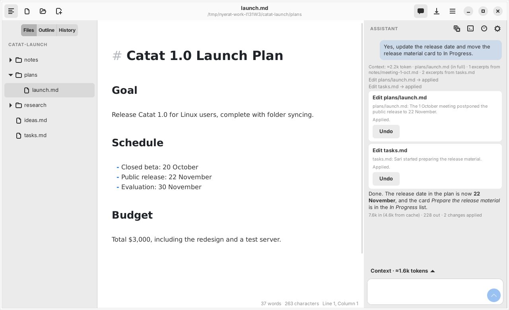
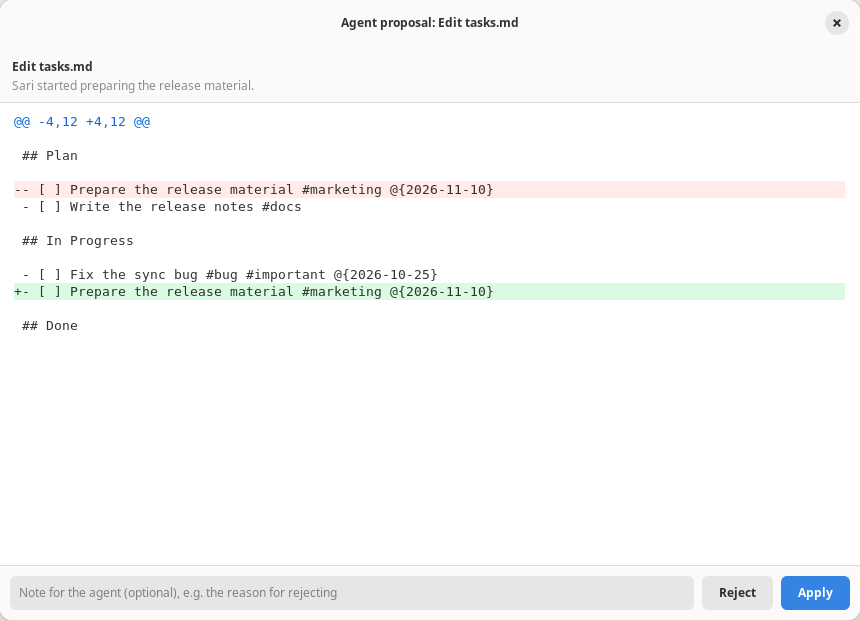

# Nyerat

Nyerat is a **personal workbench for humans and AI agents** on the Linux desktop: a personal workspace where you and an AI agent work on notes, documents, research, plans, and tasks with the same context. The agent does not stop at an answer: it browses your files, then proposes real actions (creating a file, changing text, moving a task card) as a diff that you review and approve first. Its foundation is a Markdown editor with a live formatted view, a kanban board, and Git history. Built with **GTK 4**, **GtkSourceView 5**, and **GJS** (JavaScript for GNOME). The code is written in **TypeScript** and bundled with **Vite**.

There is no separate preview panel: the text is shown formatted right away. Markdown syntax such as `#`, `**`, `` ` `` and `[](url)` is hidden, and appears again when the cursor is on that line.

Its landing page is in [`docs/`](docs/index.html) and only shows the agent features; the complete feature documentation per topic is in [`docs/docs/`](docs/docs/index.html) (static HTML; enable GitHub Pages from the `/docs` folder of the `main` branch to publish it). The screenshots are made by [`scripts/capture.ts`](scripts/capture.ts).

## Goal: personal workbench for humans and AI agents

The goal of Nyerat is to be a personal workspace where the user and an AI agent work with the same context: notes, documents, research, decisions, plans, and tasks in one work folder. The agent helps to understand information, make plans, and finish work with results that the user can check. Writing remains one of the main workflows. The principles of its development:

- **The context comes from the workspace.** The open documents (including unsaved ones), the selection, the cursor position, and a map of the whole folder are assembled automatically; the model also browses files by itself with read-only tools
- **Transparent.** Every answer shows what context was sent, what lookups were made, and how many tokens were used
- **The user stays in control.** The agent reads freely, but never writes by itself: it can only propose new files or changes, and files are only touched after you press *Apply* on the diff. Later action capabilities must provide a clear access boundary and a result that can be reviewed; an action that needs approval waits for the user's approval. The documents sent to the model provider can be limited through switches, and the API key is your own
- **The text stays yours.** Everything is plain Markdown in plain files (they can be diffed and committed to Git); no closed format and no account

The current state: a Markdown editor, kanban, Git history, and a DeepSeek-based agent that browses documents, answers with quotes of the file and the line number, reads the Git history of the work folder (`git_log`, `show_commit`, `file_at_commit`), and proposes actions that are approved through the review window: new files (`create_file`), text replacement (`edit_file`, one occurrence or all of them), text insertion (`insert_text`), removing and moving files (`delete_file`, `move_file`), and changes to a kanban board (`edit_kanban`: cards and lists). The agent does not write work files without your approval; a batch may be applied partially, a decision can come with a note for the agent, and a change that has been applied can be undone from the panel. The work plan (`set_work`), change batches (`propose_batch`), the check of the result (`verify_work`), and the action journal are stored together with the conversation. Pending work can be resumed after the app is opened again.

Nyerat can also be an **orchestrator of external harnesses**: a kanban card assigned to `@pi` is worked on by [pi](https://pi.dev) in another project folder (for example the repo `~/web-ecommerce`), not in the Nyerat work folder. Nyerat builds the prompt from the card, runs the harness, moves the card to *In Progress* and then *Review*, records a summary of the result on the card, and shows the log of the tools that were called. When pi asks a question or asks for permission, the card gets the status *waiting* and you answer straight from Nyerat. One project is worked on by one harness at a time; other cards queue.

The next direction of development: expanding the context sources and adding other actions that stay reviewable and controllable. Not available yet: an automatic consistency check, actions by the Nyerat agent itself outside Markdown (for example running commands; that is only done by an external harness that the user runs from a card), and model providers other than DeepSeek (see *Limitations*).

### An example workflow

One day of work in a sample folder: a product launch project with `plans/launch.md`, `notes/meeting-1-oct.md`, a `research/` folder, and a `tasks.md` board.

1. **Home.** Start the day on Home: the files to continue, today's journal, agents that are running, due dates from your boards, and the unprocessed inbox.
2. **Inbox.** Capture ideas, links, and quick notes in one line, then process them later and turn the ones worth doing into kanban cards.
3. **Journal.** Write short notes through the day with `Ctrl+Shift+J`. Nyerat adds the activity for you: cards moved, agent changes applied, harness results, and Git commits.
4. **Kanban.** Plan the work on a board. Due dates show up on Home, and checking a task there writes `[x]` back to its board.
5. **Agent.** Ask *"Is there a meeting decision that has not made it into the launch plan yet?"* and the agent answers with quotes and line numbers: the 1 October meeting postponed the release to 22 November, while the plan still says 15 November. Then ask *"Update the release date and move the release material card to In Progress."* Two proposals open in a review window with a Git-style diff; press *Apply* or *Reject*. A card marked `@pi` goes to the external harness instead.

At the end of the day, *Summarize Journal with Assistant* proposes a summary that is only written after you apply it.





## The meaning of the name

**Nyerat** comes from a word in Sundanese and Javanese that means *to write*. Writing is the foundation of this workspace: notes, plans, and work results stay stored as documents that are easy to read and edit, with a clean appearance so that the user can focus on their work.

## Requirements

- Linux with an X11 or Wayland desktop
- GJS (tested with version 1.80)
- libadwaita 1 (tested with 1.5) for the native GNOME appearance: the header bar, a light/dark theme that follows the system Dark Style, an adaptive layout, and the About dialog. On a newer libadwaita Nyerat uses its features if they exist: the system accent color (≥ 1.6) and `Adw.ShortcutsDialog` (≥ 1.8, GNOME 49+). That path has not been tested on the development machine (Ubuntu 24.04, libadwaita 1.5); to use it, run through Flatpak with the GNOME 50 runtime (see [Installing](#installing)).
- GTK 4 (tested with 4.14) and GtkSourceView 5. The GTK 4 libraries are usually already on a modern desktop (also on XFCE, which itself uses GTK 3); only its GObject Introspection bindings need to be installed. GTK 3 and GTK 4 are installed side by side without replacing each other.
- WebKitGTK 6.0 with the GObject Introspection bindings (`gir1.2-webkit-6.0` on Debian/Ubuntu), **only for Mermaid and DBML diagrams**; without it the app keeps running and diagrams show an error message
- Node.js 20.19+ on the 20 series, or 22.12+ (a requirement of Vite), **only for the build** (tested with Node.js 24). The app itself is run by GJS, not Node.js.

On Ubuntu/Debian:

```bash
sudo apt install gjs gir1.2-gtk-4.0 gir1.2-gtksource-5 gir1.2-adw-1
```

For diagrams, add the optional dependency:

```bash
sudo apt install gir1.2-webkit-6.0
```

For the **assistant (chat with the AI)**, add libsoup 3 (almost certainly already there because WebKitGTK uses it) and, optionally, libsecret to store the API key in the keyring:

```bash
sudo apt install gir1.2-soup-3.0 gir1.2-secret-1
```

Without libsoup only the assistant does not work; without libsecret, the key is stored in a file with 0600 permissions.

Images from the internet are loaded through GIO and need the GVfs HTTP/HTTPS backend that is available on the system.

## Running

Just once, install the development dependencies (Vite, TypeScript, and the GJS/GTK types):

```bash
npm install
```

Build and then run:

```bash
npm start
```

After it is built, the app can be run directly without npm, including to open a specific file (a file that does not exist yet will be created when it is saved):

```bash
gjs -m dist/nyerat.js plan.md
```

The app uses the first argument that is not an option as a file or folder path. Every invocation opens its own process and window; inside that window other files are opened as tabs. Without an argument, the tabs with files that were open when the last window was closed are opened again. On the first opening without a file, the editor shows a sample document; if there are no tabs to restore, the next openings start with an empty document.

Or open a folder, whose contents appear in the Files tab:

```bash
gjs -m dist/nyerat.js ~/notes
```

| Command | Function |
| --- | --- |
| `npm run build` | Check the types (`tsc --noEmit`), then bundle with Vite into `dist/` |
| `npm run dev` | Development mode: rebuild, check the types, and reopen the app every time a file is saved |
| `npm run watch` | Only rebuild automatically every time a file is saved, without opening the app and without the type check |
| `npm run typecheck` | Only check the types |
| `npm start` | Build, then run the app |
| `npm test` | Build, then run all the unit, GUI, and kanban mouse tests on Xvfb |
| `npm run test:ui` | Build, then run the same test suite on the X11 desktop |
| `npm run test:live` | Build, then run live tests against the DeepSeek API on the sample manuscript (needs `DEEPSEEK_API_KEY` in `.env`, see `.env.example`; not part of `npm test`) |
| `npm run bench` | Build, then measure the performance of the Markdown module and the editor (setText, highlighting, typing) on Xvfb; options: `--size=`, `--runs=`, `--budget=`, `--no-gui` |
| `npm run bench:save` | Run the benchmark and save the result to `bench/<date-time>.json` |
| `npm run bench:compare` | Run the benchmark and show the difference against [`bench/baseline.json`](bench/baseline.json) (green = faster, red = slower, gray = a difference < 25%, measurement noise) |
| `npm run docs` | Take screenshots of the real app (a window opens briefly), then update the PNGs and GIFs in `docs/assets/` for the landing page |
| `npm run pot` | Make the translation template `po/nyerat.pot` from the files in `po/POTFILES.in` |

The results of the optimizations and the limits of their coverage are recorded in the [performance report](bench/PERFORMANCE.md). The cost of batches, verification, and checkpoints is recorded in the [agentic performance check](bench/AGENTIC.md).

The benchmark uses 10 repetitions after warm-up. The results show the median, p95,
and maximum in milliseconds; `--save=...` stores the raw samples, the commit, and the versions of
GJS/GLib/GTK and the environment. `--compare=...` only compares an equivalent format, size,
repetitions, kind of document, mode, and environment. A baseline in an old format needs to be made again.

The GUI scenarios cover opening text (the total until the layout finishes and the longest main
loop pause, which is what feels like "freezing"), re-highlighting, typing (the total of 20
characters, the latency per character, and through the TextView keybinding signal at the end of a long
paragraph), Enter, moving the cursor, a large paste with emoji and a long line,
delete, undo, redo, and autosave (the synchronous write and the main thread part of the background autosave). Every edit is verified through the highlighting callback.
`--budget=...` applies to the median of GUI operations; for typing, the budget applies per
character. A failed measurement returns exit code 1 and prevents saving a
partial result; a complete result that exceeds the budget can still be saved for diagnosis.
Every GUI process is limited to 120 seconds (`--timeout=...`), using `timeout` from
GNU coreutils, so that a callback blocked by GC does not make the runner wait without limit.
The GUI sizes can be set with `--sizes=25,50,100`; `--size` sets the size of the Markdown
module. `--fixture=long --size=2000 --sizes=2000` tests a document of 20,000 lines
without table grids, and `--fixture=book --size=400 --sizes=50,200,400` tests a book manuscript
(long wrapped paragraphs, dialogue, *italic*/**bold**, ±1.6 KB per block; 400 blocks ≈ 650 KB,
about 100,000 words); the default kind of document is `mixed`. Asynchronous image/diagram rendering and kanban board interactions have not been measured;
kanban currently covers the parsing and serialization of the model.

### Installing

`npm start` runs the app straight from `dist/` without installing it (the GSettings schema and the icons are read from the bundle folder). To install it on the system together with the desktop file, the AppStream metainfo, the icons, the schema, and the translations, use Meson after the build:

```bash
npm ci && npm run build
meson setup _build --prefix=/usr
meson install -C _build
```

The Flatpak manifest with the GNOME 50 runtime is in [`build-aux/flatpak/com.ekaput.Nyerat.json`](build-aux/flatpak/com.ekaput.Nyerat.json):

```bash
flatpak-builder --user --install --force-clean _flatpak build-aux/flatpak/com.ekaput.Nyerat.json
```

This manifest downloads the npm dependencies during the build (`--share=network`), so it is suitable for a local build; Flathub needs generated npm sources (`flatpak-node-generator`). Meson and Flatpak have not been tested on the development machine (neither is installed); `desktop-file-validate` and `appstreamcli validate` have passed.

### Translations

The source language of the interface is English. Text in the code is wrapped in `_()` (or `fmt(_('… {name} …'), { name })` for text that contains values, `pgettext()` when a context is needed) from `src/i18n.ts`; text in `.ui` files is given `translatable="yes"`. To add a language: `npm run pot`, copy `po/nyerat.pot` to `po/<code>.po`, translate it, and then add its code to `po/LINGUAS`. Meson compiles the translations into `<prefix>/share/locale`; from `dist/`, the catalogs are looked up in `locale/` at the root of the repo.

### Development mode

```bash
npm run dev
```

Every time a file in `src/` or `tests/` is saved, `npm run dev` rebuilds and then closes and reopens the app. GJS cannot reload code that is running (there is no HMR like in a browser), so reopening the app is the way to see a change. At the same time, `tsc --watch` checks the types and reports its errors in the same terminal with the label `[types]`.

- If the build fails (for example there is a syntax error), the old app keeps running until the error is fixed.
- A type error is only reported, it does not stop the build. Vite can still build code whose types are wrong, so the app is still reopened. Watch the `[types]` lines in the terminal.
- Arguments after `--` are passed on to the app, for example `npm run dev -- notes.md` or `npm run dev -- ~/notes`.
- **Unsaved changes in the editor are lost** every time the app is reopened.
- `Ctrl+C` stops everything (the build, the type check, and the app).

The script is in [`scripts/dev.mjs`](scripts/dev.mjs). This script uses the `build()` API of Vite in watch mode, and then reopens the app on every `END` event, unless that build round failed.

## Features

**Live formatted writing**
- Headings, **bold**, *italic*, ~~strikethrough~~, ==highlight==, `inline code`, links, and images are formatted right away
- Code blocks, quotes, and horizontal rules are styled (nested quotes `>>` are indented further, up to three levels); the ```` ``` ```` fence lines are hidden outside the block
- **Home.** A special tab (a house icon) that summarizes what you can continue: a greeting according to the time, *Continue* cards (the latest files from different folders), *Today's journal* (the number of notes and activities, with a quick capture button), *Agent* that is working, queued, or waiting for your answer (click to answer, see the log, or open its board), *Due dates* from all the kanban boards in the work folder (unfinished cards that are overdue or due today, tomorrow, or the day after, with the project name from `#project/…`; the checkbox writes `[x]` straight to its board), an *Inbox* that still has unprocessed items, and *Recent files*. Home opens when the app starts without saved tabs and when the last tab is closed (it can be turned off in Preferences), and through `Alt+Home` or the ☰ menu → *Home*. Its data is recalculated from the Markdown files every time Home is shown or the window becomes active again, without a database.
- **The daily journal.** `Ctrl+Alt+J` (or the ☰ menu → *Today's Journal*, or the *Today's journal* row on Home) opens `journal/YYYY-MM-DD.md` in the work folder, made from a template (*Today's focus*, *Notes*, *Activity*, *Summary*) if it does not exist yet. `Ctrl+Shift+J` records one time-stamped line in the *Notes* section without leaving the document you are working on (through the editor if the journal is open, one undo step). Throughout the day Nyerat records work activity to `.nyerat/activity/YYYY-MM-DD.jsonl`: kanban cards that move to another list, are checked as done, or are added; agent changes that are applied; and harness results. When the journal is opened, that activity together with the Git commits of that day is merged into the *Activity* section as time-stamped items with `[[…]]` links; the merge only adds lines that are not there yet, so the user's edits are not overwritten. The command palette → *Summarize Journal with Assistant* asks the agent to propose an end-of-day summary through the normal review window
- **Inbox.** A Markdown file whose frontmatter contains `inbox: true` opens as an inbox, a place to capture ideas, links, and quick notes: the `#` heading and the paragraph before the first item become the title and the description, every list item becomes one note with `#tag` as a chip and `➕ 2026-10-07 14:32` as the capture time (the age label "10 minutes ago", "1 hour ago", "3 days ago"). Type in the topmost field and press Enter for a quick capture (the note goes in at the top), *New Note* opens a dialog with a title, tags, and notes, click a note to edit it (the capture time is kept), and ✕ removes it. Every change is written to the Markdown text (one undo step); `Ctrl+Shift+B` switches to the text view, the ☰ menu → *New Inbox* and right-click in the file tree → *New Inbox…* create an inbox.
- **A Trello-style kanban board.** A Markdown file whose frontmatter contains `kanban: true` opens as a board: a `##` heading becomes a list, a `- [ ]` item becomes a card. Drag a card between lists (or to another position in the same list), click a card to edit its title and notes, right-click for a menu (move, up/down, delete), check the box to mark it done, and add cards/lists right on the board. `#tag` is shown as a colored label and `@{2026-10-20}` as a date (red if overdue). In the card dialog, the due date can be typed (with a time if you like, e.g. `2026-10-20 09:00`) or chosen with the calendar button next to its field (with *Today* and *Clear*); choosing a date keeps the time that was already typed. Every change is written to its Markdown text, and the old `kanban-plugin:` marker of the Obsidian Kanban plugin is still recognized. `Ctrl+Shift+B` switches to the text view and back; the ☰ menu → *New Kanban Board* creates an empty board (without a name yet), and right-click in the file tree → *New Kanban Board…* creates it right away as a file in that folder
- **`[[note]]` links on cards.** In a card title they are shown as links that can be clicked; in the notes of a card they are shown as a `↗ name` row below the chip. The notes field in the card dialog suggests names when you type `[[`. When a card is worked on by pi, the contents of the linked note (or only its `#heading` section) are copied into the prompt as context
- **Cards worked on by an external harness (pi).** Write `@pi` in a card title (or fill in *Assigned to* in the edit dialog), then right-click → *Work on it with pi*. The project is taken from the card tag `#project/name` or the board frontmatter `project: name`; the project folder is asked for once and then remembered in the settings (a card without a project is given a tag from the name of its folder). The card chip shows the status: ◇ assigned, ◌ queued, ● working, ⏸ waiting for an answer, ✓ done, ✕ failed, ■ stopped. When it starts, the card moves to the *In Progress* list; when it finishes, to *Review* with the note `↳ pi done …: summary` (failed: `↳ pi failed …: reason`, the card stays). **Answering pi:** if pi ends its turn with a question (the answer ends with `?`) or a pi extension asks for permission/input (e.g. a confirmation before `rm -rf`), the card becomes ⏸ *waiting for an answer* and stays in *In Progress*; right-click → *Answer pi…* opens its question with an answer box (permission: *Allow*/*Deny*; a choice; an input; or *End without replying*). *Later* leaves pi waiting. While pi works there is *Steer pi…* (received before the next step, without stopping the work), and after it finishes there is *Reply to pi…* which continues the same pi session so the card is worked on again. The card menu also has *View pi Log* (tools, reasoning, answers, your requests and answers, tokens, cost, and the session id for `pi --session <id>`), *Stop pi*/*Cancel Queue*, *Remove Assignment*, and *Change Project Folder…*. Pi itself does not ask for tool permission; permission requests come from the pi extensions you install. Nyerat does not write to the project folder; its changes are reviewed in that repo itself (pi is asked not to commit)
- **Tables are rendered as a grid** (cell lines, a bold header, left/center/right alignment, and **bold**/*italic*/`code`/links inside cells). When the cursor enters a table, its raw text appears for editing; click a cell in the grid to edit that cell right away. A table that is wider than the text column is narrowed and cut-off text is given "…" (its full contents appear as a tooltip)
- Inside a table: `Tab` / `Shift+Tab` move between cells (in the last cell, `Tab` adds a row), `Enter` moves to the next row (on the last empty row, `Enter` leaves the table). The ☰ menu → **Edit Table** to add/delete rows and columns, align left/center/right, and tidy up the columns
- The contents of a code block are colored according to its language (```` ```js ````, ```` ```python ````, ```` ```rust ````, and hundreds of other languages from GtkSourceView), with a color scheme that follows light/dark mode
- **Mermaid diagrams.** A ```` ```mermaid ```` block is rendered as a diagram (flowchart, sequence, class, state, ER, gantt, pie, and the other kinds that Mermaid supports). When the cursor is outside the block only the diagram is visible; when the cursor enters, the code appears and the diagram becomes a preview below it that changes as you type. Wrong code is not hidden, its error message appears below the block. A double click enlarges the diagram, and its colors follow light/dark mode. Diagrams are rendered locally (without the internet); the HTML export loads Mermaid from a CDN so the diagrams in the exported file need the internet
- **DBML diagrams (dbdiagram).** A ```` ```dbml ```` block (the schema language of dbdiagram.io) is drawn as an ER diagram with the same behavior as Mermaid. Supported: `Table` (alias, `pk`, `unique`, `note`, `ref:` inside a column, `indexes`), `Ref` both as a single line and as a block with the relations `>` `<` `-` `<>`, and `Enum`/`TableGroup`/`Project`/`Note` that are skipped. The column on the "many" side of a relation is automatically marked FK. A syntax error appears immediately with its line number. The HTML export writes it as a Mermaid ER diagram
- A `- [ ]` task list can be checked by clicking its box
- Links are opened with **Ctrl+click** (relative paths are computed from the folder of the file); a link to a Markdown file opens in a Nyerat tab itself
- **Obsidian-style links between documents.** `[[Note Name]]` links to another Markdown file in the work folder by its name (without the extension, case-insensitive, in any subfolder); `[[Note|other text]]` shows other text and `[[Note#Section]]` jumps to a heading. On other lines only the name or its text is shown as a link. **Ctrl+click** opens the note in a tab; a note that does not exist yet is opened as an empty document next to the source document and is only written to disk after it is saved. Typing `[[` shows file name suggestions (↑/↓ choose, Enter/Tab insert together with `]]`, Esc closes). When several files have the same name, the one in the same folder as the source document is used, then the one with the shortest path; write `[[folder/Name]]` to choose another. The HTML export writes it as a link to `Name.md`
- An image `` is shown right below its line, from a local file (relative paths are computed from the folder of the document) or from the internet. Click the image to bring up its syntax; a **double click** (or the ☰ menu → *Zoom Image* for the image on the cursor line) opens a viewer with zoom: the mouse wheel zooms at the pointer, `+`/`−`, `0` for 100%, `F` or the *Fit* button to fit the screen, drag to pan, `Esc` closes
- Enter continues a list, a numbered list, a task list, and a quote automatically; Enter on an empty item ends it
- Tab / Shift+Tab set the indentation of a list item

**View**
- **Many documents in one window (tabs).** The tab bar appears above the editor as soon as there are two or more documents. Clicking a file in the Files tree or choosing it in the *Open File* dialog opens a new tab (or switches to its tab if that file is already open; an empty unsaved document is reused), and *New* (`Ctrl+N`) makes an empty tab. Every tab has its own undo history, cursor, and scroll position; the Focus/Typewriter/Source modes and the theme apply to all tabs. The `•` mark on a tab title means it is not saved, `Ctrl+W` closes a tab (asking if there are changes; closing the last tab empties its document), and `Ctrl+Tab` / `Ctrl+Shift+Tab` (or `Ctrl+PgDn` / `Ctrl+PgUp`) switch tabs. With autosave on, leaving a tab saves it right away. The outline, the word count, the search, and the History tab follow the active tab, and the assistant reads the contents of other unsaved tabs, not the version on disk. **Tabs are restored**: when the app is opened again without arguments, the tabs with files of the last session are opened again with their order, the active tab, and their cursor positions; files that no longer exist are skipped (with a message in the status bar). Opening a file or folder from the command line does not restore tabs
- A sidebar with three tabs:
  - **Files**: the tree of the opened folder (through the folder button in the header bar, `Ctrl+Shift+O`, or by choosing a folder in the Open File dialog), with subfolders and Markdown files (`.md`, `.markdown`, `.mdown`, `.mkd`). Click a file to open it; the file that is open is also highlighted. Hidden files/folders and `node_modules` are not shown. **Right-clicking** a folder, a file, or an empty area opens a menu with *New File…*, *New Folder…*, *New Kanban Board…*, and *New Inbox…* (for a folder/file, *Rename…* and *Delete* are added; delete asks for a confirmation and moves to the Trash, not a permanent delete; if the open document is deleted, its contents stay in the editor and are marked as unsaved; a renamed file keeps a Markdown extension, and the open document follows its new name): the item is created in the folder that was clicked (for a file: in its parent folder; for an empty area: in the root folder). A file name without a Markdown extension is given `.md`, a name that is empty, contains `/`, starts with a dot, or already exists is rejected with an error message; a new file is opened in the editor right away. *New Kanban Board…* makes a file with an empty board (`kanban: true`, the lists *Plan*, *In Progress*, *Done*) that is saved right away and opened as a board. **Drag and drop** moves a file or a folder: drop it on a folder to put it there (a closed folder that is hovered over for a moment opens by itself), drop it on a file to move it to that file's folder, or drop it on the tree title/an empty area to move it out to the root folder. A folder cannot be moved into itself, and a conflicting name in the target folder is rejected without overwriting. If the open document (or its parent folder) is moved, the document stays open with its new path. The tree updates automatically when a file is added or deleted on disk, and the last folder is opened again when the app starts
  - **Outline**: the list of headings of the document; click to jump
  - **History**: the git commits that touched the open file, newest first (short hash, message, author, relative time; the history follows a file that is renamed). If the file differs from the last commit (or is untracked), the *Uncommitted changes* button appears above the list and opens the diff against HEAD (a new file is shown entirely as additions). Below it, the *Uncommitted (N)* list holds all the files in the repository that are changing (M modified, A newly staged, D deleted, R renamed, U untracked); click one to open its diff in the same window (it can also be committed from there). Every row has a checkbox (all checked at first); write a message and press *Commit N files* to commit several files at once (`git add --all` + `git commit --only` on the chosen files; open documents are saved first). This list is also shown when no file is open but a folder is open. Click a commit to open a reading window with two tabs: *Changes* (a diff against the previous commit, added/removed lines colored) and *Contents of this version* (the complete file at that commit). The window of uncommitted changes also has a message field and the *Commit this file* button: the document is saved first, and then only that file is committed (`git add` + `git commit --only`; other files are not included, git hooks are not run). Apart from that the app never changes the repository. The history is loaded when the tab is visible, 100 commits at a time (the *Load more* button), and reloaded when switching files, when the window becomes active again, or through the reload button. It needs `git` installed; a file outside a repository or one that is not committed yet shows a message in the tab
- Focus mode: paragraphs other than the one being edited are dimmed
- Typewriter mode: the active line is always in the middle of the screen
- Source mode: all the Markdown syntax is shown; image widgets, table grids, and diagrams are hidden
- Dark mode, automatically following the system theme the first time it is opened
- The text column is centered with a comfortable reading width

**The AI agent (chat and actions with approval)**
- A panel on the right side (`Ctrl+Shift+A` or the bubble button in the header bar) to work with an agent based on a **DeepSeek** model (ask, request a plan, or request changes) (`deepseek-flash` or `deepseek-v4-pro`, chosen in the panel settings; the *Deep thinking* checkbox turns on a thinking mode that is more thorough but slower and more expensive). Answers stream as they are made, are shown with Markdown formatting, and the thinking process of the model can be opened separately. The assistant browses documents and proposes changes through a diff window; the user chooses Apply or Reject
- **The context is assembled automatically from the workspace**: the open documents (the editor contents, including unsaved ones; if too long, the part around the cursor), the selected text, the cursor position, a map of all the Markdown files in the opened folder (name, word count, headings), and the most relevant excerpts of other files (searched from the question, the selection, and the two previous questions). `@filename` in a message (optional) attaches a whole file right in the first message, so the model does not need a browsing round to read it; even without it the model searches and reads other files by itself through tools. The **Context** button below the panel details what will be sent together with its estimated tokens and has three switches (the active document, the selection, other files)
- **The agent browses the workspace by itself (function calling).** The initial context only holds the parts that are chosen automatically, so the model is also given four read-only tools: `list_files`, `search_documents` (a topic), `search_text` (exact text, e.g. a name, a date, or a number), and `read_file` (the contents of a file by line range). For a question like "is there a meeting decision that has not made it into the launch plan?", the model searches for every occurrence of the topic by itself, reads the surrounding parts, and then answers with quotes of the file and the line number. Every lookup is shown as a small line above the answer (e.g. *Searching text “Raka” → 3 lines*). The tools use the editor contents for open documents, only read Markdown files in the opened folder, and follow the *Other files in the folder* switch: turned off, there are no tools at all
- **Git history for the agent.** When the work folder is a Git repository, the agent also has three read-only tools: `git_log` (the latest commits, for the whole folder or one file following renames, together with the files that changed), `show_commit` (the diff of one commit), and `file_at_commit` (the contents of a file at an old commit, including files that were deleted). A question like *"when was the release date changed and by whom?"* is answered from the history. git is run in the work folder with a pathspec that only covers non-hidden Markdown files; a commit may only be a hash or `HEAD~n`, and no git command that changes the repository is available
- **Change proposals with approval.** If you ask for it, the model can also call `create_file` (a new Markdown file), `edit_file` (replace an exact piece of text that appears exactly once, or every occurrence with `all: true`), `insert_text` (insert text at the start of a file after the frontmatter, at the end, or after a given line; a line number must come with the contents of that line so a miscount is rejected), `delete_file` (move to the Trash), and `move_file` (rename or move to another folder; an open document follows its new path). These tools do not write anything: the review window opens automatically with a view like a Git history diff (the reason at the top, a colored diff with line numbers and three lines of context) and the *Reject* and *Apply* buttons; a compact status card remains in the panel with a *Review changes* button to open it again. Closing the window is the same as rejecting. Apply on an open file changes its editor in one undo step (`Ctrl+Z`); on another file, or a new file, it is written to disk right away (a new file is opened in a tab). The application is cancelled with an error if the contents of the file have already changed since it was proposed, and names outside the work folder, starting with a dot, or containing `..` are rejected. The result of Reject, an error, or Stop is sent back to the model so that it does not insist. For kanban boards there is `edit_kanban` (the card actions `add`, `move`, `mark` done/not done, `edit` the text, `delete`; the list actions `add_list`, `rename_list`, `delete_list` that only applies to an empty list so that cards do not disappear with it): it works through the board model (`markdown/kanban.ts`), matches lists and cards by their text (exactly one must match, otherwise the model is given a list of candidates), and its result still goes through the review window. The diff uses a real line diff with several hunks, so moving a card only marks that card, not the whole board. This tool only exists when the *Other files in the folder* switch is on.
- **Partial approval, notes, and Undo.** The review window of a batch has a checkbox per file: uncheck to reject part of it (the button becomes *Apply 2 of 3*); the agent is told which files were applied and which were rejected, and the journal records both separately. The *Note for the agent* box below the diff is passed on together with the decision, e.g. the reason for rejecting, so that the agent can fix its proposal. A proposal card that has been applied has an *Undo* button (also in a conversation that is opened again): it applies the reverse of the change through the same checks, so it fails without overwriting anything if the file has been edited again; a deleted file is restored from a snapshot and a move is reversed. The journal marks it *Undone* so that the agent does not consider it still applicable
- Every answer is given the details of the context that was sent and the token usage (including the part served from the cache, and the number of lookups). **The documents that are included are sent to the DeepSeek server**; turn off the *Other files in the folder* and *The currently open document* switches to ask without sending documents
- **The agent log (monitoring).** The terminal button in the header of the Assistant panel opens the *Agent log* window, in two panes: on the left a tree of every turn (its model rounds, and in each round the reasoning, the tool calls, and the answer, with the duration of each step; rounds can be folded); on the right everything about the selected step, with metric cards (duration, result size, share of the turn's time, tokens in/cached/out) and the tabs *Summary*, *Arguments*, *Result*, and *Raw*, plus buttons to copy the arguments, the result, or the whole event. The detail follows the newest step while the agent works, until you pick one. The filters All/Tools/Reasoning/Model, *Copy all*, and *Clear*. The log only exists in memory while the app runs (at most 2,000 events, the details cut at 20k characters), is not sent to the model, is not written to the conversation file, and is emptied by *New conversation*
- **Conversation history saved per folder.** Every conversation is written as one Markdown file in `<work folder>/.nyerat/chats/` (e.g. `2026-10-04-is-there-a-meeting-decision-not-yet-in-the-plan.md`, holding the frontmatter `title`/`model`/`created` and then the turns `## You` and `## Assistant`), updated after every turn and at action checkpoints. The frontmatter `work` and `actions` store the goal, steps, verification, decisions, and the before/after snapshots to see the diff again. The thinking process of the model is not saved. The clock button in the panel header opens the list of conversations in that folder (newest first): click to restore one and continue in the same file (its history is sent to the model too), or the trash icon to move it to the Trash. *New conversation* (the broom icon) starts a new file. The history holds quotes from the manuscript, so `.nyerat/` is automatically given a `.gitignore` containing `*` (delete that file if you want to commit it); dot folders are not shown in the Files tree and are not read by the assistant as manuscript. The *Save conversation history in the folder* switch in the panel settings (the gear) turns it off; without an open folder nothing is saved
- The API key is taken from the `DEEPSEEK_API_KEY` environment variable, or entered in the panel settings (the gear icon) and stored in the system keyring; if the keyring is not available, in `~/.config/nyerat/deepseek.key` (mode 0600). The key is not written to the settings

**Other**
- Find text, undo/redo, the word and character count, the cursor position
- Export to HTML with the CSS included. Images and links keep their original URL/path; Mermaid/DBML diagrams need the internet to load Mermaid from a CDN
- **Autosave** (the ☰ menu → *Autosave*, on by default): a document that already has a file is saved automatically 1 second after you stop typing (the write to disk runs in the background, so it does not hold up typing), and is saved without asking when closing, making a new document, or opening another file. A document that has never been saved still needs Ctrl+S
- A warning before closing, making a new document, or opening another file if there are unsaved changes (when autosave is off or the document does not have a file yet)

## Shortcuts

| Shortcut | Function |
| --- | --- |
| Ctrl+N / Ctrl+O | New document / open a file (both in a new tab) |
| Ctrl+W | Close the tab |
| Alt+Home | Home |
| Ctrl+Alt+J | Today's journal |
| Ctrl+Shift+J | Add to the journal (quick capture) |
| Ctrl+Tab / Ctrl+Shift+Tab or Ctrl+PgDn / Ctrl+PgUp | Next / previous tab |
| Ctrl+Shift+O | Open a folder |
| Ctrl+S / Ctrl+Shift+S | Save / save as |
| Ctrl+Shift+E | Export HTML |
| Ctrl+F | Find |
| Ctrl+Z / Ctrl+Shift+Z or Ctrl+Y | Undo / redo (also for changes on a kanban board) |
| Ctrl+Shift+B | Kanban board or inbox: switch between the board/inbox view and the text |
| Ctrl+Q | Quit |
| Ctrl+B | Bold |
| Ctrl+I | Italic |
| Ctrl+Shift+X or Alt+Shift+5 | Strikethrough |
| Ctrl+Shift+H | Highlight |
| Ctrl+` | Inline code |
| Ctrl+K | Link |
| Ctrl+Shift+I | Insert an image |
| Ctrl+Shift+K | Insert a code block |
| Ctrl+T | Insert a table |
| Tab / Shift+Tab | Move between cells (inside a table) |
| Enter | Move to the next row (inside a table) |
| Ctrl+Shift+T | Tidy up the table |
| Ctrl+1 … Ctrl+6 | Heading 1–6 |
| Ctrl+0 | Back to a paragraph |
| Ctrl+Shift+Q | Quote |
| Ctrl+Shift+] / Ctrl+Shift+[ | Bulleted list / numbered list |
| Ctrl+\ or Ctrl+Shift+1 | Show/hide the sidebar |
| Ctrl+/ | Source mode |
| F8 | Focus mode |
| F9 | Typewriter mode |
| Ctrl+Shift+D | Dark mode |
| Ctrl+Shift+A | Show/hide the Assistant panel |
| Ctrl+Shift+P | The command palette: search for and run any command |
| Ctrl+, | Preferences |
| Ctrl+? | The list of keyboard shortcuts |
| Enter / Shift+Enter | In the Assistant message box: send / new line |

## Tests

Install the virtual display dependencies once (Debian/Ubuntu):

```bash
sudo apt install xvfb xauth
```

There are two modes to run all the tests, including the five kanban mouse tests:

```bash
npm test          # without showing windows, using Xvfb
npm run test:ui   # show the windows and the card drags on the desktop
```

`npm test` runs all the unit and GUI tests and the five kanban mouse input tests on a **separate Xvfb display**. It does not need a desktop session; the desktop pointer does not move. If Xvfb is not installed, the command fails and the mouse tests are not silently skipped. `npm run docs` still uses the desktop capture path as before.

On Xvfb, the tests use Mesa software rendering (`LIBGL_ALWAYS_SOFTWARE=1`) and turn off GPU compositing and the DMA-BUF renderer of WebKitGTK (`WEBKIT_DISABLE_COMPOSITING_MODE=1 WEBKIT_DISABLE_DMABUF_RENDERER=1`) because a virtual display does not provide a DRI3 device. This avoids the libEGL warning during the Mermaid and DBML diagram tests; this setting only applies to `npm test`.

`npm run test:ui` runs the same test suite on the **local X11** desktop (or XWayland that provides a local `DISPLAY`), so the test windows are visible. This mode does not need Xvfb. The desktop pointer will move during the drag tests; leave the mouse and keyboard alone until it finishes. The pointer is returned to its original position after the mouse part of the tests.

The tests are written in TypeScript without an additional framework, bundled by Vite into `dist/run-tests.js`, and then run by GJS. The script exits with code `1` if anything fails. What it contains:

- **Unit**: Markdown → HTML conversion, the inline format parser, saving/reading settings, the table and kanban models, code language aliases, DBML, file operations (create/rename/delete/move), the git output parser, and the assistant, without a GUI
- **Editor**: opens a real window, and then checks hidden/shown syntax, Enter and Tab in lists, format shortcuts, undo, clicking a task box, and saving and opening files
- **Tables**: the table recognition rules (a one-dash separator, no pipes at the edges, stopping at another block), splitting cells, alignment, tidying columns (including CJK and emoji widths), row/column operations, converting inline formats to Pango markup, the column width; and then in the editor: a grid that appears and disappears following the cursor, the position of a grid between paragraphs, clicking a cell, Tab/Shift+Tab/Enter, all the menu commands, one command = one undo step, source mode, and a table with emoji that does not make GTK fail to draw
- **External harness**: `@name` assignment (not an email/`@{date}`), the project from frontmatter or a tag, rejecting the work folder, the prompt (including the related `[[ ]]` notes: the heading section, the missing ones, and the length limit), RPC commands (prompt, steering, dialog answers, one line per command), the pi event reader (tools, reasoning, cost, the session from `get_state`, a rejected command, an extension request, errors), question detection, the result note, the queue per folder (including a run that waits for an answer); in the GUI with a real fake pi (a shell script that speaks RPC): cwd and the prompt, a card to *In Progress* and then *Review* with a note, the log, a queue in order, stop, failure, a project folder that is asked for and remembered, a board that is not open being updated on disk, a permission request that waits and is then answered (and *Later* that keeps waiting), a question that is answered or ended without replying, steering while working, and a reply that continues the same session; `[[note]]` on a card goes into the prompt and can be clicked without opening the edit dialog
- **Kanban**: the model (recognizing a board, reading and writing with a stable result, card and list operations, tags and dates); in the editor: a document opens as a board, adding/checking/editing/moving through the menu, dragging a card (dropping at the indicated position, the ghost card and the drop marker are cleaned up, the original place changes nothing), automatic scrolling at the edge, undo/redo one step per change, switching to the text view and back, text editing actions rejected while the board is shown, and saving
- **Mermaid diagrams**: a block is rendered as an image, the code is hidden outside the block and shown with a preview inside it, a syntax error is shown without hiding the code, re-rendering when the code changes, the widget is reused when lines shift, an empty/unclosed/non-mermaid block is ignored, source mode, and the dark theme (the image background color); and also its HTML export
- **DBML diagrams**: the DBML → Mermaid translator (tables, columns, refs, aliases, schemas, errors with their line number), a dbml block is rendered and its error is shown without hiding the code, and also its HTML export
- **Image zoom**: the full-size image from `imageAt()`, a single vs a double click (through a `GestureClick` triggered by the test) and the right image when one line holds several, the menu command; in the viewer: the initial zoom, multiples of 1.25 and the limit of 5%–800%, keys, zooming at the pointer, dragging to pan, a double click, and no GTK/cairo warning when drawing at a large zoom
- **Code block colors**: language name aliases, keyword/string/comment colors, a block without a language or with an unknown language, re-coloring while typing, an emoji before the block, light/dark schemes, and focus mode that still dims code blocks
- **Git history**: the log/diff parser and relative time (unit); in the GUI, the list of commits of the active file, the uncommitted changes button, the *Uncommitted* list with checkboxes, committing one or several files at once in a temporary repository, and the commit reading window (the *Changes* and *Contents of this version* tabs)
- **Folder**: the contents of the tree and their order, hidden and non-Markdown files being filtered, the contents of a subfolder being read when it is opened, opening a file with a click, highlighting the active file, automatic updates when a file is added/deleted on disk, and a folder from an argument and from the settings; the right-click menu *New File*/*New Folder*/*New Kanban Board*/*New Inbox* (at the root, in a folder, and next to a file), moving files/folders into and out of folders, rejecting invalid/conflicting names/moving into itself, an open document that follows its new path, and drag-and-drop with the real X11 mouse
- **Live tests against the API** (`npm run test:live`, needs `DEEPSEEK_API_KEY` in `.env`, not part of `npm test`): four scenarios on the manuscript `tests/samples/sample-book` that deliberately holds contradictions, including one with a context budget of 900 tokens so that the model must use tools; `-- --thinking` for thinking mode and `-- --model=...` for another model
- **The assistant**: building the context (splitting per heading, BM25, the token budget, a window around the cursor, @attachments, a stable `system` prefix, trimming the history), reading the SSE stream and the error messages, the answer markup, the DeepSeek client against a fake server, then the browsing tools (results, limits, errors), the agent loop (tools sent back, reasoning returned, the limit of rounds and the budget, cancellation), building the tool messages for the API, and then the panel: a message sent with the right document/selection/excerpts, the browsing steps shown, a formatted answer with tokens, history, `@name`, the context switches, errors and cancellation, Enter/Shift+Enter, and the key and model settings (all with a fake provider; no network)
- **The complete sample document**: opens `tests/samples/all-formats.md`, and then checks the tag of every format, the tricky cases, and its HTML export result
- **Window size**: opening a second file does not enlarge the window, the window can be enlarged and then shrunk, and images are limited to the width of the text column
- **Robustness**: the cursor is swept over all the lines, typing on every line, and the document is deleted bit by bit to look for crashes

An additional option, run after `npm run build`:

```bash
gjs -m dist/run-tests.js --mouse
```

The tests that drag a card through mouse input from the X11 server (press → gradual motion → release) are included in both modes: `npm test` and `npm run test:ui`.

`npm test` uses Xvfb with the XTest extension; `npm run test:ui` uses the desktop display. All the test code and helpers are written in **TypeScript**, bundled by Vite and run by GJS; there is no dependency on Python or `xdotool`. The helper uses Gio to connect to the X11 socket and reads the authentication from `XAUTHORITY` (or `~/.Xauthority`). The pointer position is restored after the mouse tests, and the left button is released if a test fails. The settings and the test documents use temporary folders.

Five scenarios check moving between lists together with notes/emoji, the order within one list, an empty target, dropping at the original position, and a click without a drag. The tests also check the press/motion/release events that GTK receives, the cleanup of the ghost and the drop marker, the Markdown, one undo/redo step, and the saved result. The input is sent directly through the **FakeInput** request in the [XTest protocol](https://xorg.freedesktop.org/archive/X11R7.6/doc/xextproto/xtest.html), not by calling the card handlers or making fake event objects. The input is still automatic; this does not prove manual testing with a physical mouse or a Wayland session. If the input is not received by GTK, the test **fails** (exit code `1`), it is not skipped or counted as passing.

| Option | Function |
| --- | --- |
| `--no-gui` | All the unit tests, without opening a window |
| `--mouse` | Add real mouse clicks through XTest (the pointer will move by itself). Skipped with a note if your environment does not pass the XTest mouse buttons on to GTK (this happens on the XFCE/X11 used to develop this); pointer motion alone does not count as a test |
| `--with-kanban-mouse` | Add the five kanban mouse input tests to all the unit and GUI tests; used by `npm test` on Xvfb and `npm run test:ui` on the desktop. It cannot be combined with `--no-gui` |
| `--screenshot=file.png` | Save a screenshot of the editor window |
| `--shot-harness=prefix` | Save screenshots of the board with pi cards working/queued (light and dark), the pi log window, a card waiting for an answer, and the permission/question answer dialogs (`prefix-board.png`, `-board-dark.png`, `-log.png`, `-waiting.png`, `-answer-permission.png`, `-answer-question.png`) |

The tests use a temporary settings folder, so your settings are not touched.

### The sample file

[`tests/samples/all-formats.md`](tests/samples/all-formats.md) holds all the supported formats together with the tricky cases: nested emphasis, escapes, URLs with underscores, emoji and non-Latin text, a table without pipes at the edges, a four-backtick code block, and unclosed emphasis. Open it in the editor to check its appearance manually:

```bash
gjs -m dist/nyerat.js tests/samples/all-formats.md
```

This file is also used by the automatic tests, so if you add a new format, add its example here too.

## Architecture
### Folder structure
```
package.json              npm scripts and development dependencies
tsconfig.json             TypeScript type-checking settings
vite.config.ts            Vite build settings
scripts/dev.mjs           npm run dev: rebuild + reopen the app + type check
scripts/layers.mjs        npm run layers (also in build/typecheck): forbidden imports between layers, and cyclomatic complexity ≤ 15 per function
scripts/capture.ts        capture the editor and make the PNG/GIF files for docs/assets/
scripts/gifenc.d.ts       gifenc type declarations for the capture script
scripts/pot.sh            npm run pot: the translation template po/nyerat.pot
docs/                     static landing page and screenshot assets
meson.build               system/Flatpak install (installs the contents of dist/ after npm run build)
build-aux/flatpak/        Flatpak manifest (GNOME 50 runtime)
po/                       translations: POTFILES.in, LINGUAS, <language>.po
data/                     GSettings schema (compiled into dist/ at build time), desktop and metainfo files (.in), app icon, the nyerat.in launcher
dist/                     build output (not in git)
src/
├── main.ts               entry point: only calls main() from app.ts
├── env.d.ts              types for GJS and gi:// modules (from the @girs packages)
├── gtkutil.ts            GTK 4 helpers for all layers: line iterators, widget children, click/key handlers, modal dialogs without a nested main loop (modal(), after()), pack(), pixbuf ↔ Gdk.Texture, icons from dist/
├── i18n.ts               gettext: _(), fmt(), pgettext(), ngettext(); the domain is bound before the other modules are evaluated
├── app.ts                creates the Gtk.Application and the window
├── window.ts             MainWindow: assembles the components and connects them; shows the documents kept by window/documents.ts; export
├── window/               feature controllers of the window, each given a narrow host instead of MainWindow
│   ├── doc.ts            the open document record (Doc) and the shared DocumentHost
│   ├── journal.ts        today's journal, quick capture, end-of-day summary, the activity log
│   ├── harness.ts        @pi cards: card menu, project folders, answer/steer/reply, run logs; owns the Orchestrator
│   ├── home.ts           the data behind the Home tab and the actions taken from it
│   ├── agentwrites.ts    applying approved Assistant changes (editor for open files, disk otherwise, rollback)
│   ├── autosave.ts       autosave timers and quiet saves
│   ├── documents.ts      DocumentController: the open documents/tabs, the active one, open/save/Save As, asking before discarding, the Home tab, restoring tabs
│   ├── views.ts          ViewController: text, board, inbox, or Home for the active document; board/inbox changes ↔ document text; updateBoardFile for the orchestrator
│   └── notes.ts          NoteLinks: following [[note]] links and the note names for [[ suggestions
├── actions.ts            all the app's Gio.Actions and their shortcuts (setting toggles use Gio.Settings.create_action); sees the window only as `ActionHost`
├── colors.ts             the document color palettes (pure data, shared by editor/ and ui/)
├── config.ts             app name, ID, version, and fonts
├── settings.ts           AppSettings: typed properties on top of Gio.Settings (schema in data/com.ekaput.Nyerat.gschema.xml)
├── commands.ts           action names for the command palette
├── activity.ts           daily activity log for the journal at <work folder>/.nyerat/activity (append-only JSONL)
├── files.ts              read/write UTF-8 text files; background writes queued per path; onDiskChange for the app's own changes
├── workspace.ts          WorkspaceRepository: the Markdown files of a work folder (snapshot watched by file monitors, LRU contents cache, unsaved overlay, background warming); used by chat, Home, [[ suggestions, harness (GLib/GIO)
├── fileops.ts            create, rename, delete (to the trash), and move files/folders on disk (no GTK; used by the file tree)
├── orchestrator.ts       runs the external harness (pi) for kanban cards in the project folder: process, queue, board updates
├── git.ts                the git history of a file and the list of uncommitted files through the `git` command (async; read-only, except committing selected files); also runs the agent's Git tools
├── gitlog.ts             git output parser: log, diff, relative time (pure, no GTK); also the agent's GitRequest/GitAnswer types
├── welcome.ts            the sample document shown on first launch
│
├── agent/                the AI assistant: manuscript context and model client (no GTK, except where noted)
│   ├── tools.ts          pure: browsing tools for the model (list_files, search_documents, search_text, read_file)
│   ├── context.ts        pure: splitting the manuscript per heading, BM25 search, building the context within a token budget, trimming the history
│   ├── session.ts        pure: one conversation (history) and the one-turn agent loop (model ↔ tools, including waiting for approval of proposals)
│   ├── chatcontroller.ts the conversation life cycle without widgets: send/stop, folder-change guards, saving and reopening history, undo, context preview; drives the panel through ChatView
│   ├── changes.ts        pure: the proposal tools (create, edit, insert, delete, move, kanban), validation into a `Change`, change inversion and preflight, diff preview; never writes
│   ├── gittools.ts       pure: the agent's Git history tools (git_log, show_commit, file_at_commit): argument validation and output tidying
│   ├── work.ts           pure: goal, plan, work status and the set_work tool
│   ├── harness.ts        pure: the external harness for kanban cards: project, prompt, the pi JSON reader, queue per folder
│   ├── trace.ts          pure: the agent activity log (rounds, reasoning, tools with separate arguments and result, tokens) for the Agent log window
│   ├── tracetree.ts      pure: the log as a tree (turn → round → step), statistics, and short formats for durations and sizes
│   ├── batch.ts          pure: batch planning, preflight of all files, and rollback through the host
│   ├── verification.ts   pure: text checks (per file or the whole folder), kanban card status, and Markdown structure with no new problems in the actual content
│   ├── journal.ts        pure: the action history and reconciliation of interruptions from the actual content
│   ├── recovery.ts       pure: limited retries and excerpts of old history
│   ├── path.ts           path validation and symlink rejection when writing (Gio)
│   ├── transcript.ts     pure: conversation ↔ Markdown text (frontmatter + `## You` / `## Assistant`), titles and file names
│   ├── chatstore.ts      save, list, load, and discard conversations in `<folder>/.nyerat/chats` (Gio)
│   ├── provider.ts       the Provider interface (used by the real client and the fake provider in tests)
│   ├── sse.ts            pure: reads SSE stream lines (text, reasoning, tool-call chunks, usage) and HTTP error messages
│   ├── deepseek.ts       DeepSeek client through libsoup 3 (GIO/GLib; loaded on use)
│   └── apikey.ts         API key: environment variable, keyring (libsecret), or a 0600 file
│
├── markdown/             understanding Markdown (pure TypeScript, no GTK)
│   ├── syntax.ts         regexes for headings, lists, quotes, tables, emphasis
│   ├── inline.ts         parseInline(): formatting within a single line
│   ├── table.ts          tables: recognizing blocks, splitting cells, tidying, adding/removing rows and columns
│   ├── kanban.ts         kanban boards: reading/writing Markdown, card and list operations, tags, dates, and @harness assignment
│   ├── inbox.ts          inbox: reading/writing Markdown, capturing/editing/deleting notes, tags, capture time and age
│   ├── home.ts           Home data: deadlines from boards, unprocessed inbox, recent files, greeting
│   ├── journal.ts        daily journal: template, quick capture, merging Activity, board events, the JSONL activity log
│   ├── pango.ts          table cell contents (inline Markdown) → Pango markup for Gtk.Label
│   ├── chatmarkup.ts     assistant answers (headings, lists, quotes, code blocks, inline) → Pango markup
│   ├── dbml.ts           DBML (dbdiagram.io) translator → Mermaid ER diagram
│   ├── html.ts           markdownToHtml(): for HTML export
│   └── wikilink.ts       [[note]] links: parsing, file lookup, name suggestions
│
├── editor/               the editor engine
│   ├── view.ts           MarkdownView: the editor widget, ties together the modules below
│   ├── tags.ts           text styles (GtkTextTag) and their colors
│   ├── highlighter.ts    applies tags according to the syntax, collects markers
│   ├── decorations.ts    hides markers, dims text (focus mode)
│   ├── editing.ts        formatting commands: bold, link, heading, quote
│   ├── lists.ts          Enter and Tab in lists and quotes
│   ├── clicks.ts         clicking task boxes, reading link URLs and [[note]] targets
│   ├── wikicomplete.ts   note name suggestions when typing [[
│   ├── images.ts         shows images below their lines, and handles clicks/double clicks
│   ├── tablelayer.ts     renders tables as a grid that appears/disappears following the cursor
│   ├── codelayer.ts      renders code blocks as boxes that scroll sideways (raw text when the cursor is inside)
│   ├── mermaid.ts        shows ```mermaid and ```dbml blocks as diagrams (the same pattern as tables)
│   ├── mermaidrender.ts  renders Mermaid code to a pixbuf through an invisible WebKitGTK
│   ├── overlays.ts       overlay widget slots reused by images, tables, and diagrams
│   ├── tableedit.ts      Tab/Enter in tables and the Edit Table menu commands
│   ├── codehighlight.ts  colors the contents of code blocks according to their language
│   ├── tagsync.ts        applies tags by diff (only the ranges/lines that changed)
│   └── offsets.ts        UTF-16 ↔ code point position conversion
│
└── ui/                   interface components
    ├── *.ui              declarative layouts (Gtk.Template) for the headerbar, statusbar, findbar, preferences, palette, and chat; bundled by Vite as text (`?raw`)
    ├── headerbar.ts      buttons and the ☰ menu (headerbar.ui)
    ├── preferences.ts    Adw.PreferencesDialog bound to GSettings (Ctrl+,)
    ├── palette.ts        the Ctrl+Shift+P command palette: Gio.ListStore → FilterListModel → ListView on top of Gio.Action
    ├── sidebar.ts        tabbed sidebar (Adw.OverlaySplitView): Files, Outline, and History
    ├── filetree.ts       Files tab: a Gio.ListStore per folder → Gtk.TreeListModel → ListView + TreeExpander, right-click menu, drag and drop, watched with Gio.FileMonitor
    ├── outline.ts        Outline tab: a Gio.ListStore of headings in a ListView
    ├── history.ts        History tab: git commits for the active file (ListView)
    ├── historyviewer.ts  window for reading a single commit: the diff and the contents of that version
    ├── logviewer.ts      Agent log window: the tree of the agent's activity on the left, updated live
    ├── logdetail.ts      the right pane of the Agent log: metrics, arguments, result, and raw text of the selected step
    ├── proposalviewer.ts window for reviewing the agent's change proposals: the same diff, a checkbox per file in a batch, a note for the agent, Reject/Apply buttons
    ├── findbar.ts        search bar (its target follows the active tab)
    ├── tabbar.ts         Adw.TabBar + Adw.TabView for document tabs (shown when there are ≥ 2 documents)
    ├── statusbar.ts      word count and cursor position (short notifications through Adw.Toast in window.ts)
    ├── dialogs.ts        file chooser, save confirmation, error, about (return a Promise)
    ├── shortcuts.ts      keyboard shortcut dialog (Ctrl+?) from the accels of the installed actions: Adw.ShortcutsDialog if available, otherwise an Adw.Dialog with a list
    ├── menu.ts           context menus as data (MenuEntry) → Gtk.PopoverMenu
    ├── imageviewer.ts    image viewer with zoom (Adw.Window, texture scaled through a GSK snapshot)
    ├── kanban.ts         kanban board view: lists, cards, menus, drag and drop
    ├── inbox.ts          inbox view: quick capture, note list, age, tags
    ├── home.ts           Home tab: Continue card, agent, deadlines, inbox, recent files
    ├── chat.ts           Assistant panel on the right: draws the messages and the input (implements ChatView)
    ├── chatsettings.ts   its settings popover: API key, model, thinking mode, saving conversations
    ├── chathistory.ts    its history popover: saved conversations to reopen or delete
    ├── chatcontext.ts    its Context button and popover: token estimate, parts, switches
    ├── proposalcard.ts   change proposal cards, the review window they open, and Undo
    └── theme.ts          fonts and CSS from the palette in colors.ts (named Adwaita colors for the interface, the system accent if available)
tests/
├── run-tests.ts          entry point and registration of unit/GUI tests
├── framework.ts          assertions, test results, CLI options, temporary folders
├── fixtures.ts           shared kanban board data for model and GUI tests
├── widgets.ts            GUI test helpers: widget screenshots, widget children, fake clicks through GestureClick, X11 screen positions
├── unit/                 tests without a window: inline, HTML, settings, tables, kanban, code languages, DBML, file operations, the assistant (context, SSE, session), the conversation file format, the DeepSeek client (fake server)
│   └── helpers.ts        helper for getting the body of the HTML result of a conversion
├── gui/                  tests for the editor, files/folders, images, tables, diagrams, kanban, external harness, history, assistant, size, robustness
│   ├── context.ts        window/editor context and GUI test helpers
│   ├── kanban-mouse.ts   five drag/click tests through X11 mouse input
│   └── mouse-input.ts    TypeScript X11/XTest client through Gio
└── samples/
    ├── all-formats.md    a document with all the formats, for tests and manual checks
    ├── kanban-board.md   a sample kanban board to try out
    ├── inbox.md          a sample inbox to try out
    └── images/example.png  the local image referenced by that document
```

### Build: TypeScript + Vite

Vite is used only as a **bundler** (library mode in [`vite.config.ts`](vite.config.ts)). Its dev server and HMR are not used, because this is a GTK app run by GJS, not a web page.

```
src/main.ts ─────────┐                        ┌─► dist/nyerat.js         (the app)
tests/run-tests.ts ──┼─► tsc --noEmit ─► vite ┼─► dist/run-tests.js      (tests)
scripts/capture.ts ──┘   (type check)  (bundle)├─► dist/capture.js        (docs capture)
                                             └─► dist/chunks/*.js       (shared code)
node_modules/mermaid/dist/mermaid.min.js ────────► dist/mermaid.min.js     (copy of the browser script)
```

- **Two build steps.** Vite turns TypeScript into JavaScript without checking types. That is why `npm run build` runs `tsc --noEmit` first, and the build stops if there is a type error.
- **GJS built-in modules are marked `external`**: `gi://...`, `system`, `gettext`, `cairo`, and `console`. These modules are provided by GJS at runtime, so they are not bundled and not looked up in `node_modules`.
- **Target `firefox115`**, because GJS 1.80 uses the SpiderMonkey 115 JavaScript engine.
- **Types for GTK, GLib, and the rest** come from the `@girs/*` packages (the ts-for-gir project). They are registered in [`src/env.d.ts`](src/env.d.ts), so `import Gtk from 'gi://Gtk?version=4.0'` is recognized by TypeScript. These packages are only used for type checking and do not go into `dist/`.
- **Imports between modules still use the `.js` suffix** (for example `'./tags.js'`), even though the file is `.ts`. TypeScript and Vite both map it to the `.ts` file.
- **Input through GTK 4 controllers.** The GTK 3 `key-press-event`/`button-press-event` signals no longer exist. Keys and clicks are captured by `Gtk.EventControllerKey` and `Gtk.GestureClick` through the `onKeyPress()`/`onClick()` helpers in [`src/gtkutil.ts`](src/gtkutil.ts). The handlers receive plain numbers (keyval, modifier, click count, position), not event objects, so tests can call them directly (`MarkdownView.onKey(keyval, state)`, `onClick(n, x, y, state)`).

### Layers and the direction of dependencies

The code is divided into layers. Each layer may only use the layers below it, never above:

```
 app.ts
   └─ window.ts ── actions.ts
        ├─ window/*        feature controllers (documents, views, note links, journal, harness, Home, agent writes, autosave)
        ├─ ui/*            interface components
        ├─ editor/*        the editor engine
        │    └─ markdown/* Markdown rules (no GTK)
        ├─ orchestrator.ts runs harness processes (pi) for window/harness.ts (GLib, no GTK)
        │    └─ agent/harness.ts  prompts, RPC, the pi stream reader, the run queue
        ├─ agent/*         manuscript context and model client (no GTK)
        └─ settings.ts, files.ts, workspace.ts, git.ts, gitlog.ts, config.ts, colors.ts
```

- **`agent/`** is also free of GTK. `ui/chat.ts` uses it, and the window only gives it a way to fetch the manuscript (`ChatHost`: the active document, the selection, project files, the manuscript folder). `agent/` knows nothing about the editor or widgets. The panel only draws: `agent/chatcontroller.ts` owns the conversation's life cycle and tells the panel what to show through the `ChatView` interface, so sending, stopping, a folder change mid-request, and reopening a saved conversation are tested without GTK (`tests/unit/chatcontroller.ts`).
- **`markdown/`** does not import GTK at all. It only contains string → data functions, so it is the easiest to study and test.
- **`editor/`** knows nothing about files, menus, or the sidebar. `MarkdownView` only reports through callbacks (`onHighlighted`, `onCursorMoved`, `onMessage`).
- **`ui/`** holds self-contained components. `Outline` does not know the editor; it only receives a list of headings and calls `onJump(line)` when clicked. `FileTree` is the same: it only displays folders and calls `onOpenFile(path)`; the window decides how to open the file (a new tab, switching to an existing tab, or reusing an empty document).
- **`window.ts`** is the only place where components are connected to each other. For example: after highlighting, the editor calls `onHighlighted`, and then the window passes the headings to `Outline` and the text to `StatusBar`. The open documents (tabs, open/save, the Home tab, restoring tabs) are kept by `window/documents.ts`, which tells the window what must follow a document on screen through `DocumentsHost`. Features that span several components (the journal, harness runs, Home, applying agent changes, autosave) live in `window/*` controllers too; each receives a narrow host interface built by the window from closures, never `MainWindow` itself, so they do not import `window.ts`. `actions.ts` likewise types the window as `ActionHost`.
- **`orchestrator.ts`** sits between `window/harness.ts` and `agent/harness.ts`: it spawns the harness process and moves cards, using the pure parts in `agent/` and translated strings, but no GTK and no widgets.
- **Lower layers do not reach up.** `editor/` takes the `Palette` type from `colors.ts`, not from `ui/theme.ts`; `git.ts` takes the agent's Git request types from `gitlog.ts`, not from `agent/`.
- **The rules are checked.** [`scripts/layers.mjs`](scripts/layers.mjs) runs in `npm run build` and `npm run typecheck` and fails on a forbidden import: GI or anything outside `markdown/` in `markdown/`, GTK or `ui/`/`editor/`/`window/` in `agent/`, `ui/`/`window/`/`agent/` in `editor/`, `window.ts` in `ui/`, `window/`, or `actions.ts`, and any upper layer in the base modules.
- **Function complexity is checked too.** The same script parses `src/` and `scripts/` with the oxc parser that Vite already ships (`rolldown/parseAst`) and fails on a function whose cyclomatic complexity (counted like ESLint's `complexity` rule; nested functions on their own) is above 15 (lowered from 20 once every function met it). The functions that were above the limit have all been split, so `COMPLEXITY_ALLOWED` is empty; an exception listed there may not grow, and its entry has to go once the function is split.

### The editor workflow

There are two main cycles in `editor/view.ts`:

```
Text changes ───► queueHighlight() ───► highlight()
                                          ├─ highlighter.ts   apply style tags,
                                          │                   collect markers + headings
                                          ├─ tablelayer.ts    update table blocks
                                          ├─ codehighlight.ts color code block contents
                                          ├─ mermaid.ts       update Mermaid/DBML diagrams
                                          ├─ images.ts        show the images found
                                          ├─ onHighlighted()  → outline, status bar
                                          └─ updateCursor(true)

Cursor moves ──► queueCursorUpdate() ──► updateCursor()
                                          ├─ decorations.ts   hide markers outside
                                          │                   the active line, dim (focus)
                                          ├─ tablelayer.ts   show the grid or raw text
                                          ├─ mermaid.ts      show the diagram or code + preview
                                          ├─ typewriter     scroll the active line to the middle
                                          └─ onCursorMoved() → status bar
```

Both are deferred with `GLib.idle_add(PRIORITY_HIGH_IDLE)`. Several consecutive changes (for example when pasting text) are merged into one pass, and the pass finishes before GTK redraws the screen, so nothing flickers.

### How the hidden syntax effect works

1. **`highlighter.ts`** reads the whole document when it is first opened, and then only the edited range when the text changes. For each syntax it applies a style tag to the contents (for example `bold` on "bold" in `**bold**`) and records the position of its delimiters (`**`) as **markers**.
2. Each marker stores the range of lines where it is "active": `[start, end, firstLine, lastLine, line]`. For inline formats the range is just its own line. For ```` ``` ```` fences the range is the whole code block, so the fences appear as long as the cursor is inside the block.
3. **`decorations.ts`** applies the `hidden` tag to every marker whose line range does not contain the cursor. When the cursor changes line, only this step is repeated; the full highlight does not need to run again.

**Tags are applied by diff (`editor/tagsync.ts`).** Removing the tags from the whole buffer and then applying them again makes GTK lay out the whole document again (the heading tags, `hidden`, and the table/image spacing change the line sizes), and that is the most expensive thing in a long document. So:

- Highlighting reads only the buffer lines that changed, and then parses the range between safe code/table context boundaries. Results outside that range are reused with adjusted offsets. An edit inside code/tables re-parses the block concerned; a new code fence may extend parsing to the end of the document. A snapshot holds the current result of the document; the extra token cache is limited to 10,000 entries and 4 Mi UTF-16 units, without storing lines above 4,096 units.
- The word/character count is updated from the edited range. The full text is only joined on request, so the status bar does not read and recount the whole document.
- Syntax and `hidden` tags are applied through `LineTagger`, which remembers the last tags on each line. `MarkdownView` records the edited range (the `insert-text`/`delete-range` signals, stored as two `GtkTextMark`s), so when re-highlighting only the edited lines or those whose tags differ are touched. The other lines are simply left alone: the tags move along with the text.
- When opening or pasting many lines, adjacent tag ranges are merged before being applied, so GTK receives fewer operations. A highlight called directly from `setText()` cancels the highlight callback that is still queued.
- Unchanged tables and code block colors keep the tags that already moved along with the text in GTK. The outline keeps its labels when only the heading line numbers change; the click targets are still updated.
- Tags with few ranges (`dim`, `tablehide`, `mermaidhide`, table/image/diagram spacing, code block colors) are applied with `setTagRanges()`: the ranges that are already applied are read from the buffer, and then only the difference is removed or added.
- The test "incremental highlighting is the same as highlighting from scratch" (`tests/gui/robust.ts`) edits the sample document randomly and checks that the result is the same as highlighting from scratch.

`parseInline()` in `markdown/inline.ts` makes a copy of the characters only when masking is needed, and reuses the masked string as long as nothing changes. It uses a **masking** technique: after a part is recognized (for example inline code), its characters are replaced with `\0` so that later patterns do not recognize them again. That is why `` `**not bold**` `` is still shown as code.

### Technical things to know

**Text positions (`editor/offsets.ts`).** GtkTextBuffer counts positions per Unicode character, while JavaScript strings count per UTF-16 unit. The emoji 🎉 is 1 in GTK but 2 in JavaScript. The highlighter works with JavaScript positions, and converts them with `makeCpMap()` just before touching the buffer.

**Hiding text without `invisible` (`editor/tags.ts`).** The `invisible` attribute of GtkTextView in GTK 3 could trigger the crash *"Byte index is off the end of the line"*. That is why the `hidden` tag makes the text very small and the same color as the background. The result on screen is the same, but the problematic GTK code path is not touched. This approach was kept after moving to GTK 4 because the whole layout of tables, diagrams, and markers depends on it.

The size is **not 1** (a Pango unit, 1/1024 pt) but 256 (`TINY` in `editor/tags.ts`). The color emoji font is a bitmap font, and at size 1 its scale becomes zero so GTK fails to draw the whole window (*"invalid matrix (not invertible)"*). This was discovered when a table containing emoji was shrunk; there is a test that guards it.

**The centered text column (`editor/view.ts`).** The left/right margins are calculated from the width of the visible area, which is the `page_size` of the horizontal adjustment that the TextView fills in when it is allocated (GTK 4 has no `size-allocate` signal). The ScrolledWindow uses `hscrollbar_policy: EXTERNAL`, not `NEVER`. The minimum width of a wrapped GtkTextView equals its current width plus the margins. With `NEVER`, that minimum width is passed on to the window, so the window cannot shrink and keeps growing every time the margins are recalculated.

**Opening a long document without freezing (`replaceAllText()` in `editor/view.ts`).** GTK gives a height of 0 to lines that have not been laid out yet. If the first image after the text is replaced covers an area below the lines that have been laid out (the TextView pixel cache draws half a screen extra, and `bottom_margin` extends the canvas), GTK lays out *all* lines up to the end of the document at once on the main thread; a 650 KB manuscript used to freeze for ±0.6 seconds when opened. `replaceAllText()` zeroes the scroll position and then queues a scroll to the cursor, so GTK first lays out two screens around the cursor and the rest bit by bit in the background. Use this function whenever replacing the entire contents of a TextView that can be long (the editor, the history viewer). Do not change `bottom_margin` at runtime: every change makes GTK lay out the whole document again. The scroll to the cursor is only queued if the TextView already has a size: before that (the window is not shown yet, a new tab in a `Gtk.Stack`) GTK 4 stores the scroll and then runs it with empty geometry, so the document opens in the middle or at the end. The test `a long file in a new tab opens from the start, not scrolled to the middle` in `tests/gui/tabs.ts` guards this.

**Incremental highlighting on open (`queueFill()` in `editor/view.ts`).** `setText()` still parses the whole document (the line structure, headings, and offsets are needed right away), but syntax tags and hidden markers are only applied for the first 200 lines. The rest are fed in by an idle with priority `HIGH_IDLE + 22` (≤8 ms per turn): above the GtkTextView background layout (125) so that lines are laid out once with their final tags, below drawing (120) so that the screen keeps updating. Each turn prioritizes the lines around the cursor and the visible ones (before GTK finishes the layout, the visible area cannot be trusted because lines not yet laid out are 0 high), so jumping to the end of the document still shows formatted text. `LineTagger.defer()`/`fill()` skip the deferred lines; edits during the feeding are still highlighted as usual. The outline is also built 50 lines per turn. Tests that check the tags of a long document wait for `MarkdownView.highlightComplete`.

**Incremental hidden markers (`MarkerConcealer` in `editor/decorations.ts`).** Each keystroke and cursor move only checks the old and new active lines, the lines the highlighter re-parsed (`reparsed` in the `highlight()` result), and the lines whose tags are not yet known. A new ``` fence can change the markers of the lines below it without editing those lines, which is why the `reparsed` range must be passed on. The markers in the highlighter result are ordered by line (found by binary search), and the markers/headings/images are shifted in place after an edit because the old snapshot is no longer used.

**Reading the work folder without walking it every time (`WorkspaceRepository` in `workspace.ts`).** Chat context, Home, `[[` suggestions, and harness prompts all read the Markdown files of the work folder. The repository keeps a snapshot per folder (names, sizes, modification times) and watches every folder in it with a `Gio.FileMonitor`, so the folder is only walked again after a change; a change to a file already listed (autosave) only refreshes that file's size and time. The app's own writes and file operations reach it at once through `onDiskChange()` in `files.ts`; outside changes arrive with the monitor events. Contents are cached by size and time up to a memory limit, least recently used first out, and unsaved documents are read from their editor. Opening a folder starts `warm()`, which walks and reads in 6 ms slices from an idle callback. A read states how current it must be: `cached` (Home, suggestions, the context preview), `current` (the start of a chat turn walks again, so a file changed outside the app a moment ago is seen), or `fresh` (verification reads every file from disk). A folder with more than 512 subfolders, or one that cannot be monitored, is walked on every request as before.

**Background auto save (`writeTextFileAsync()` in `files.ts`).** Timer-driven auto save writes through Gio on a worker thread (a temporary file, fsync, then an atomic rename), so the fsync pause on a slow disk is not felt while the user keeps typing. Background writes to one path are queued: at most one runs, and a newer request replaces the one still waiting, so an older version can never finish last. All synchronous writes, moves, and deletions of files through `files.ts`/`fileops.ts` first flush the background writes to the same path (`flushWrites()`), so that old contents do not overwrite new ones. Background writes report back on their own `GLib.MainContext`, so a flush runs only write completions, never other application callbacks; their `done` callbacks follow later from the default main loop. The *modified* status is only reset if the text did not change while it was being written.

### GTK 4 notes

Nyerat runs on GTK 4, GtkSourceView 5, and WebKitGTK 6.0. Some GTK 4 behaviors (through GJS) affect how the code is written:

- **The `destroy` signal does not fire for widgets that JavaScript still holds.** A child widget is only *disposed* when its last reference is gone, and GJS holds a reference as long as its JavaScript object is alive. That is why cleanup is explicit: `MarkdownView.destroy()` (called when a tab is closed) stops the editor's idles/timers along with the image, table, and diagram layers; `MainWindow` calls `destroy()` on all its components when its window is *unrealized* (a signal that does fire when the window is destroyed). Small windows (history, image viewer) mark themselves closed through `unrealize` as well.
- **GtkTextView overlay children cannot be removed.** In GTK 4.14, `gtk_text_view_remove()` does not recognize children added with `add_overlay()` (it ends with *"GtkBox is not a child of GtkSourceView"*). `editor/overlays.ts` lends out slots (a `Gtk.Box` that is already an overlay) to images, tables, and diagrams; a returned slot is emptied, hidden, and then used by the next block. Click receivers are attached to the contents of the slot, not to the slot itself.
- **GtkTextView overlays do not scroll on their own.** Their position is in buffer coordinates, and the overlay container (`GtkTextViewChild`) subtracts the scroll offset from it when allocated. But in GTK 4.14 that offset is only updated in the TextView's `size_allocate`, and scrolling does not reallocate anything: images, tables, and diagrams stay at the old place (not visible or floating over the text). `OverlaySlots` therefore requests a reallocation of the TextView **and** its container every time an adjustment scrolls (GTK skips the allocation of a container whose size did not change). The cost per scroll step is not measurable (median ±0.22 ms with or without). The test `an image below a long document is shown in place after scrolling` and the table grid tests check the actual position of the widget, not the number stored by the layer.
- **`ListBox.remove_all()` also removes the placeholder** in GTK 4.14; `removeChildren()` (`gtkutil.ts`) removes rows one by one.
- **Modal dialogs without a nested main loop.** `gtk_dialog_run()` was deliberately removed in GTK 4: a main loop inside a handler makes other code run in the middle of that handler. The dialogs in `ui/dialogs.ts` return a Promise (`modal()` in `gtkutil.ts`), and callers continue through `after(value, continuation)`: plain values (paths that do not need to ask, or dialog fakes in tests) are processed immediately, Promises after they are answered. That is why `closeTab()`, `save()`, and `onClose()` stay synchronous when there is nothing to ask. Closing a window that needs confirmation is held back (`close-request` returns true), and then `close()` is called again once all the dialogs are answered with consent. Continuations that run after a dialog re-check the state (the tab still exists, the card is still the same) because the user may have changed it. The file chooser uses `Gtk.FileDialog` (it already asks before overwriting; on desktops with an xdg-desktop-portal, the dialog is opened by the portal). Messages and forms use `Adw.AlertDialog` and `Adw.Dialog` (`modalWindow()`), not `Gtk.AlertDialog` and without `destroy_with_parent`: both connect the dialog to the parent window's `destroy` signal, and when the process exits GJS may finalize the parent first, producing a GLib-GObject-CRITICAL.
- **Images as `Gdk.Texture`.** `Gtk.Picture.new_for_pixbuf()` (deprecated since GTK 4.12), `Gdk.pixbuf_get_from_texture()` (4.12), and `Gdk.cairo_set_source_pixbuf()` (4.20) are not used. Pixbufs are still used for loading and shrinking images, and then `textureFromPixbuf()`/`pixbufFromTexture()` (`gtkutil.ts`) copy the pixels through `Gdk.MemoryTexture` and `Gdk.TextureDownloader`. The image viewer draws its texture with `Gtk.Snapshot.append_scaled_texture()`.
- **Adaptive layout.** Two `Adw.Breakpoint`s on the window: below 900sp the Assistant panel folds into a floating panel, below 600sp the sidebar does too. The minimum window size is 360 × 294. The OverlaySplitView is set up with `pin_sidebar` so that libadwaita does not open a panel by itself when the window widens; `bindPanel()` closes the panel when folding and restores the previous setting when widening (also when the window is closed while narrow).
- **`hexpand`/`vexpand` propagate upward.** In GTK 4, a widget with an expanding child expands too. The sidebar, the History tab, the Files tab, and the Assistant panel are given an explicit `hexpand: false`, so they are not also given a share of the window's remaining space (guarded by the test `the history tab does not make the sidebar expand`). `pack(box, child, expand)` in `gtkutil.ts` replaces `pack_start()` and sets the expansion according to the box orientation.
- **The selection must not become empty in the middle of an edit.** On X11, a selection that was briefly empty releases the PRIMARY clipboard, and GTK 4 cancels the next selection as soon as the server confirms that release. `wrapSelection()` (`editor/editing.ts`) therefore only inserts/removes the delimiters at both ends, without first deleting the whole selection; without that, a second Ctrl+B does not remove the `**`.
- **The file tree (TreeListModel + ListView) and drag and drop.** Each folder is a `Gio.ListStore<FileNode>`; `Gtk.TreeListModel` also calls the child-creating function just to check whether a row can be expanded, so folder contents are stored in `dirStores` and read once. Dragging uses `Gtk.DragSource`/`Gtk.DropTarget` on the ListView; the row at the cursor is found with `pick()` (rows are direct children of the ListView, with a `TreeExpander` inside). The drop target marker uses row selection. The drag icon is taken from the icon theme; a widget as the icon (`GtkDragIcon`) triggers a Gtk-CRITICAL when the drag ends.
- **Gtk.Template without glib-compile-resources.** `.ui` files are imported as text (`import xml from './x.ui?raw'`) and given to `Template:` as a `Uint8Array` (`uiTemplate()` in `gtkutil.ts`); there is no GResource to compile. `Adw.HeaderBar` is a final class, so `HeaderBar` wraps it in an `Adw.Bin`.
- **Settings in GSettings.** The schema is in `data/` and compiled into `dist/` by the Vite plugin; `settings.ts` loads it from the bundle folder if present, otherwise from the system schema directory (the installed version). The menu toggles (`sidebar`, `chat`, `focus`, `typewriter`, `autosave`) are `Gio.Settings.create_action`, the sidebar and the Assistant panel are bound with `Gio.Settings.bind` to `show-sidebar` (through `bindPanel()`, see the adaptive layout), and `MainWindow.onSettingChanged` applies the rest (including changes from the preferences dialog).
- **Colors.** The interface (sidebar, Assistant panel, board, status colors) uses named Adwaita colors (`@accent_color`, `@card_bg_color`, `@error_bg_color`, ...), so it follows the system accent and the high contrast mode. Document surfaces (the editor, tables, text tags, diagrams) still use the `colors.ts` palette because `GtkTextTag` and diagram rendering need real color values and the `hidden` tag must be exactly the same as the editor background; the accent is taken from `Adw.StyleManager.get_accent_color_rgba()` if libadwaita ≥ 1.6.
- **Context menus as data.** `Gtk.Menu` no longer exists. Right-click menus (the file tree, cards, lists) are built as `MenuEntry[]` (`ui/menu.ts`) and then turned into a `Gtk.PopoverMenu` with `menu.*` actions; tests only need to find an entry and call `run()`.
- **Screenshots.** `gdk_pixbuf_get_from_window()` no longer exists. `tests/widgets.ts` draws a widget through `Gtk.WidgetPaintable` and then renders it into a texture with its window's renderer (used by `--screenshot` and `scripts/capture.ts`).

### How images work (`editor/images.ts`)

Images are not put in the text buffer. If `GtkTextChildAnchor` were used, every image would add a character to the document and to the undo history. Instead:

1. `highlighter.ts` records every image with its line: `{ line, url, alt }`.
2. `ImageLayer` loads the image asynchronously through GIO (a local file, or http/https through gvfs) and stores it in a cache per URI. Typing does not reload the same image.
3. Below the image line, empty space is reserved with a `pixels_below_lines` tag as tall as the image.
4. The image widget is placed over that space as a TextView overlay (a slot from `editor/overlays.ts`, positioned with `move_overlay()`). Its position is in buffer coordinates so that it scrolls along, and it is recalculated from `get_line_yrange()` every time the layout changes (a change visible through the vertical adjustment).
5. Widgets are matched by URI, not by line number. If a new line appears above, the same widget is just moved, not recreated.

Like the other formats, the whole `` is registered as a marker, so the syntax is hidden except on the active line.

### How tables work (`editor/tablelayer.ts`, `tableedit.ts`, `markdown/table.ts`)

Tables use the same approach as images: a widget is placed over an empty space inside the text, so the contents of the document do not change. The difference is that a table has two states that follow the cursor:

| Cursor | Table text | Grid |
| --- | --- | --- |
| outside the table | shrunk to ~1 px per line (the `tablehide` tag) | shown, in the space reserved below the last line |
| inside the table | shown as raw text, to be edited | gone |

1. `markdown/table.ts` recognizes table blocks (`findTables()`), and it is the only place where the table rules are written: the highlighter, the edit commands, and the HTML export all use it.
2. `highlighter.ts` passes the line range of each table on to `TableLayer`.
3. When a table needs to be shown as a grid, `TableLayer` splits its contents (`parseTable()`), creates a `Gtk.Label` for every cell with Pango markup from `markdown/pango.ts` (bold, italic, code, links), and then arranges them in a `Gtk.Grid`. The table is measured with two reused GTK cells; the full grid is only created when the table is visible. The size is stored on the active table block; the shared cache is limited to 256 tables and 1,024 cells, each with a key of at most 1 Mi UTF-16 units. Typing inside a table does not build the grid.
4. The empty space is reserved through a `pixels_below_lines` tag on the last line of the table as tall as the grid, and then the grid is placed over it as an overlay (a slot from `editor/overlays.ts`). When the cursor or the selection moves, only the tables whose state changed have their tags changed. The position is recalculated from `get_line_yrange()` only for visible grids; off-screen grids are hidden without removing their space, and positioned when scrolled onto the screen. This prevents cursor moves from forcing GTK to lay out the entire document. Changing the column width reuses the grid and resets the cell widths without tearing down the widgets; ellipsize keeps the table height the same.
5. A column is as wide as its longest text. If the total exceeds the width of the text column, narrow columns are left alone and the remaining space is divided among the wide columns (`fitColumns()`), and then the text is cut with "…". The width has to be forced with `set_size_request`, because a TextView only gives child widgets their minimum size.
6. Clicking a cell puts the cursor in that cell in the raw text (`cellStart()`), which automatically opens the table.
7. `tableedit.ts` re-reads the document from the buffer every time it is used (not from the last highlight result), and then rewrites the table lines in a single undo step. Menu commands always produce a tidied table, because adding or removing columns changes the column widths.

### How Mermaid diagrams work (`editor/mermaid.ts`, `mermaidrender.ts`)

Mermaid only runs in a browser (it needs the DOM and text measurement), so it cannot be called directly from GJS.

1. **The renderer (`mermaidrender.ts`).** A single `WebKitWebView` (WebKitGTK 6.0) that is never attached to a window loads `mermaid.min.js`. That script is copied from `node_modules/mermaid` to `dist/` by a small plugin in `vite.config.ts`. For each diagram, the page runs `mermaid.render()` and then sends its size back through a *script message handler*; a snapshot of the whole document (WebKit draws it even if the view is not shown, and its size follows the page contents) is cropped to the size of the diagram into a `GdkPixbuf`. A snapshot was chosen over SVG + librsvg because Mermaid labels use `<foreignObject>`, which librsvg does not support.
2. WebKitGTK is loaded with `import()` and the WebView is only created when the first diagram is needed, so a document without diagrams does not pay for it (and the app still runs without WebKitGTK). Diagrams are rendered one at a time, and the results are stored in a cache per (theme, code).
3. **The layer (`mermaid.ts`)** imitates `TableLayer`: the image is placed over the empty space below the closing line of the block (`pixels_below_lines`). When the cursor is outside the block, all its lines are shrunk with the `mermaidhide` tag; when inside, the code is shown and the diagram becomes a preview below it. Its tag is separate from `tablehide` because each layer removes its tags across the whole document when it syncs.
4. Rendering is delayed 400 ms after the code changes; the old diagram stays visible while it re-renders. A block that fails to render (a syntax error) is never hidden.
5. **DBML** uses the same path: `markdown/dbml.ts` (`dbmlToMermaid()`) parses DBML and writes it as an `erDiagram`, and then the result is rendered like ordinary Mermaid code. DBML errors are thrown as a `DbmlError` (containing the line number) and shown immediately by the layer without going through WebKit.

### How the kanban board works (`markdown/kanban.ts`, `ui/kanban.ts`)

**Format.** A board is an ordinary Markdown file:

```markdown
---
kanban: true
---

## Plan

- [ ] Write the report #important @{2026-10-20}
  card note (an indented line)
- [ ] Send the invitations

## Done

- [x] Book the venue
```

The frontmatter `kanban: true` (also `kanban: yes`, case-insensitive, may be quoted) marks a document as a board; the marker is looked for in the first 40 lines before the closing frontmatter delimiter. A document without the marker is still opened as ordinary text. The old marker `kanban-plugin: …` (from the Obsidian Kanban plugin, a non-empty single-token value) is also recognized, and existing frontmatter is kept as it is when saving. A `##` heading is a list, a list item is a card (`[x]` = done, no box = an ordinary item), and lines indented under a card are its note. Anything not recognized (a board title at the top, ordinary lines inside a list such as `**Complete**` or `***`, and the `%% kanban:settings` block at the end) is kept as it is, so files from Obsidian are not broken.

**Data flow.** The document text in the buffer is the single source of truth:

```
text buffer ──parseBoard()──► KanbanBoard (model + view)
     ▲                              │ commit(new board)
     └──── replaceText() ◄── serializeBoard() ◄──┘   (one undo step)
```

1. When a kanban document is opened, `MainWindow.syncMode()` swaps the editor for the board (a `Gtk.Stack`) and reads its text with `parseBoard()`.
2. Every change from the board goes through `commit()`: the new model is written with `serializeBoard()` and then put into the buffer through `MarkdownView.replaceText()`, which only replaces the middle part of the text that differs and makes it a single undo step.
3. Undo/redo (the `undo`/`redo` actions, `Ctrl+Z`) change the buffer. Changes that do not come from the board itself are recognized by comparing the text with what the board last wrote, and then the board re-reads its text.
4. All operations on the model (`addCard`, `moveCard`, `moveColumn`, …) are pure and do not change the original board, so they are easy to test. `moveCard` uses the card's *final* position in the target list, so moving down within the same list needs no adjustment.

**Dragging.** This does not use GTK's built-in drag and drop, but its own pointer handling (a `Gtk.GestureDrag` on each card): press on a card, move more than 6 pixels, release. While dragging, a ghost card (a still image of the card from `Gtk.WidgetPaintable`, in a `Gtk.Overlay` layer above the board, because GTK 4 cannot move a popup window by itself) follows the pointer, the source card is dimmed, and a dashed marker shows the destination. The destination is calculated from the pointer position: the list that contains it (or the nearest one), and then `dropIndex()` counts how many other cards have their midpoint above the pointer. Near the edge, the board or the target list scrolls automatically. A movement under 6 pixels is treated as an ordinary click and opens the edit dialog. This approach was chosen so that the behavior is controlled and can be tested by calling `onCardPress()`/`onCardMotion()`/`onCardRelease()` directly (card coordinates).

**Dialogs** (`editCardDialog`, `promptDialog`, `confirmDialog`) hold the program until they are closed, so `KanbanBoard.dialogs` can be replaced, and tests use a stand-in.

### How the harness orchestrator works (`agent/harness.ts`, `orchestrator.ts`)

```markdown
---
kanban: true
project: web-ecommerce          ← the board's default project
---

## Plan
- [ ] Checkout with QRIS @pi #feature          ← @pi = the harness assigned
- [ ] Test the cart @pi #project/shop-admin     ← the project tag wins over the frontmatter
```

```
card + [[note]] ──buildPrompt()──► pi --mode rpc --name <title> [--session <id>]   (cwd = project folder)
  ▲                         stdin ▲            │ stdout: JSONL per line
  │   get_state, prompt, steer,  │            ▼
  │   extension_ui_response ─────┘   PiReader ──► AgentTrace (pi log) + ask / settled signals
  │                                             │
  │                         ask → ⏸ waiting ──► Answer pi… (dialog) ──► the answer goes through stdin
  │                         settled + "?" → ⏸ waiting; other settled → close stdin → pi exits
  └── updateBoard(): move to In Progress / Review, a ↳ result note
```

1. **A project, not a path.** The Markdown contents only mention the *name* of a project; the name is mapped to a folder in `settings.projects`, which is only filled in through the folder chooser dialog. So a card or an agent cannot point the harness to an arbitrary folder. `checkProjectFolder()` rejects Nyerat's work folder, its contents, its parents, the root, and relative paths, because the harness writes freely without a review window.
2. **Related notes.** `cardWikiLinks()` collects the `[[links]]` in the card's title and note (at most 10, without duplicates, inline code skipped). `OrchestratorHost.linkedNotes()` in the window looks them up with `resolveWikiLink()` in the work folder (the same rules as Ctrl+click), reads their contents from the editor if open or from disk, and takes only the `#heading` section with `noteSection()`. `buildPrompt()` copies them into the *Related notes from Nyerat* section inside a fenced code block longer than any backtick run in the contents, at most 8,000 characters per note and 24,000 in total; links that are not found are mentioned as they are. The harness is not given the path of the work folder, only the contents of the notes, because the work folder is deliberately out of its reach.
3. **Running.** `Orchestrator.start()` adds `@pi` if it is not there yet, puts the run into the `RunQueue`, and then `launch()` looks for the program (PATH, then `~/.local/bin` and similar, because apps launched from the desktop menu often do not inherit the shell's PATH) and starts it through `spawnHarness()` in pi's RPC mode. The pipes are read and written with `GLib.IOChannel` (pi's JSONL framing: one command or event per line, separated by LF), not `Gio.Subprocess.get_stdout_pipe()`: after Gtk is loaded, GJS wraps that pipe as a `Gio.UnixInputStream` and prints a Gjs-WARNING. Commands are written as UTF-8 bytes with an explicit length (a string with length -1 is not guaranteed to be NUL-terminated and triggers a GLib-WARNING). Once the process is running, Nyerat sends `get_state` (the session id) and then `prompt`.
4. **The queue.** A project folder only works on one run at a time (`working` or `waiting`; a run waiting for an answer still holds its process); other cards are `queued` and start when the previous run finishes. Cancelling a queued run does not give anyone a turn.
5. **Waiting for an answer.** `PiReader.line()` returns signals. An `extension_ui_request` with `select`/`confirm`/`input`/`editor` becomes a `HarnessAsk` and the run gets the status `waiting`; the answer is sent as an `extension_ui_response` with the same id (`confirmed`, `value`, or `cancelled`). If a request has a `timeout`, pi answers by itself with a default value after it, and Nyerat returns the status to `working` at the same moment. `notify` is only recorded in the log; `setStatus`/`setWidget` are ignored (TUI only). On `agent_settled`, an answer that ends in `?` (`endsWithQuestion()`) makes the run wait; a reply is sent as the next `prompt` to the same process (`PiReader.restart()` discards the old turn state), while *End without replying* closes stdin. Other answers close stdin immediately, and pi exits in an orderly way. *Steer* sends `steer`; *Reply* after finishing runs pi again with `--session <id>` and the same log.
6. **Reading the result.** `PiReader` maps events (the `response` of `get_state`/a rejected command, `turn_start`, `message_update` text/reasoning, `tool_execution_start/end`, the assistant's `message_end` with `stopReason`/`usage.cost`, `agent_settled`) to `AgentTrace`, so the agent's `LogViewer` is reused. It fails if `stopReason` is error/aborted, the exit code is not 0 (the message = the last stderr line), or there is no answer.
7. **Finishing and stopping.** After the process exits, the remaining output gets a 1.5-second grace period: grandchild processes (commands from the harness's `bash` tool) can keep the pipe open. *Stop* sends SIGTERM, then SIGKILL after 5 seconds. Closing the window stops all running harnesses.
8. **Writing the board.** The card is looked up again by its text on the current board (`locateCard()`, must be unique). A board that is open is changed through its editor (one undo step); one that is not open is written straight to disk. The destination lists are recognized by their titles (*In Progress*/*Doing*, *Review*); if there is none, the card is not moved.

### How the assistant works (`agent/*`, `ui/chat.ts`)

The model only knows what is sent to it, so the quality of the answers is determined by `agent/context.ts`. Every question builds a fresh context (the manuscript may change between questions) within a token budget (`DEFAULT_BUDGET` = 48,000 tokens; 1 token ≈ 3 characters, deliberately wasteful). The context is split in two so that DeepSeek's prefix cache is used:

```
system message  (stable)   instructions + <project_map> + <active_document>     ← the same across questions, so the prefix is cached
history         (trimmed)  earlier questions and answers, without their old context
user message    (changes)  <extra_context> + the question                ← selection, cursor, @attachments, relevant excerpts
```

Every manuscript line that is sent is numbered at the front (`12│ text`, the real number in its file, also in the window around the cursor and in excerpts), the same as the output of `read_file`. Without numbers, the model guesses locations and often misses; the instructions forbid quoting those numbers as part of the manuscript. The live test (`npm run test:live`) checks that every `file.md:N` citation in an answer points to the right line.

The priority order and budget limits: the text selection (8%), the active document (40%; if it is longer, a window of lines around the cursor is taken and the rest is searched through excerpts), `@mention` files (20% per file), the project map (6%; more compact when there are many files), and then relevant excerpts (40%, at most 10). Excerpts come from splitting each file per heading (long sections are split at blank lines) and are ranked with BM25 over the keywords of the question (weight 1), the selection (0.5), and the two previous questions (0.4); common words are dropped and suffixes such as Indonesian *-nya*/*-kan* are stripped roughly. There are no embeddings, so there is no model download and no manuscript is sent just for searching. The history is limited to 25% of the budget, dropped in pairs from the oldest.

`ChatSession.ask()` runs the model ↔ tools loop, at most 10 rounds; the last round has no tools. The four read tools have a limit of 6,000 tokens per result and the total of read results equals the context budget. Single-change tools use `onProposal`; `propose_batch` uses `onBatchProposal` for one review of all the diffs. The Git tools use `git` in the handler (from `ChatHost.git`), counted in the same read budget. A batch produces one `Change` per file and rejects a batch that touches a file that is deleted/moved together with other actions, so each file can be applied or rejected on its own. A batch merges chained changes to the same file, checks all snapshots before writing, and tries to restore the files if a write fails. This is an in-process transaction, not a filesystem transaction that survives a power cut. Rollback failures are reported; changed contents and paths that go through a symlink are rejected.

For multi-step work, the model uses `set_work` and then `verify_work`. Verification re-reads the contents of the disk/buffer through the host (bypassing the cache) and checks required/forbidden text (per file, or across the whole folder with the file `"*"` to make sure old values do not remain in files that were not changed), cards in a given list and status, or the Markdown structure (`markdown/lint.ts`: the number of table cells, empty headings or ones that skip a level, unclosed code blocks, links to Markdown files that do not exist). The structure is compared with the contents before the work, so only problems that appear because of the change cause a failure; old problems are mentioned but left alone. For every changed file, verification automatically adds a structure check, makes sure files that were deleted/moved are really not at their old place, and requires at least one criterion from the model. The done status requires all steps to be done and the checks to pass. These checks prove concrete criteria, not the whole semantic consistency of a document; the quality of the criteria still depends on the model.

The journal stores a proposal before review and the decision after applying, including before/after snapshots. `onState` saves a checkpoint while the process is running if the save switch is on. Opening a conversation restores the plan, the journal, the Continue work button, and the button to view the history diff without re-applying. A proposal whose process was interrupted is checked against the actual contents: a result that matches the proposal is recognized as applied, an old result as an interruption, and a mixed result as a failure that needs to be inspected. A checkpoint restores the work; unsaved buffer changes still follow the editor's save rules.

The full history stays on disk. The model's context contains the latest turns and limited extractive excerpts from older turns; excerpts do not create new facts and can be cut off. The DeepSeek client retries connection failures, HTTP 429, and 5xx at most twice (300/900 ms pauses) only if no text or reasoning has been shown yet. Authentication failures are not retried. A stream that is cut off before `[DONE]` is treated as failed and does not run partial tool calls. Cancellation uses `Gio.Cancellable`, including during the retry pause.

The deterministic evaluation in `tests/unit/agentic.ts` tests work through to a verified result, rejection, conflicts, incomplete verification, and recovery after failure; `tests/unit/agentactions.ts` tests the new edit tools, delete/move, extra kanban actions, change inversion, partial approval and notes, structure checks, and the Git tools (including a real git repository in a temporary folder). The GUI tests check batches, per-file checkboxes, notes, Undo (successful and rejected because the contents changed), moving open files, deleting to the Trash, and restoring the plan. The client tests use a local SSE server; all of them are part of `npm test` without a paid API. `npm run test:live -- --agentic` adds evaluation of a real model for approval, rejection, and conflicts, only on fixtures in a temporary folder (it uses API quota). `npm run bench:agentic` measures a 20-file batch, verification, a checkpoint along with its journal, and the history summary (median/p95/maximum; no network).

### How image zoom works (`ui/imageviewer.ts`)

1. Every image in the editor (`Gtk.Picture`) has its own `Gtk.GestureClick`, so a double click knows which image is meant when one line holds several images. A single click still opens its syntax (`onActivate`); a double click (the 2nd click of the gesture) calls `onZoom`, and the *Zoom Image* menu calls `MarkdownView.zoomImage()` for the cursor line.
2. `ImageLayer.imageAt()` gives the **full-size pixbuf** from the cache (the image in the editor is only a shrunken copy), so the viewer shows the original resolution.
3. `MarkdownView` does not open a window itself. It calls `onViewImage`, and `MainWindow` opens the `ImageViewer`, so the `editor/` layer remains independent of `ui/`.
4. `ImageViewer` draws the image texture at the zoom scale in its own small widget (`ZoomArea`, `vfunc_snapshot` + `append_scaled_texture()`), instead of making an enlarged copy, so 800% zoom on a large photo does not use up memory. Zoom from 300% uses the `NEAREST` filter so that pixels are shown as they are; below 100% `TRILINEAR`.
5. Zoom is limited to 5%–800%, in multiples of 1.25 (mouse wheel through `Gtk.EventControllerScroll`; panning through a `Gtk.GestureDrag` on the ScrolledWindow that does not move along). When the mouse wheel is turned over the image, the image point under the pointer is kept from shifting: that point is calculated in image coordinates, and then the scroll position is reset after the layout finishes.
6. An image is opened in "fit the screen but never enlarge beyond 100%" mode, and follows the window size as long as the zoom has not been changed.

### How code block colors work (`editor/codehighlight.ts`)

Nyerat has no code colorer of its own. The work is handed over to GtkSourceView, which already has definitions for hundreds of languages and several color schemes:

1. `highlighter.ts` records every code block: its language (the text after ```` ``` ````), the start position of its contents, and the contents.
2. The language name is translated to a GtkSourceView id through `resolveLanguage()`. Common aliases are handled directly (`javascript` → `js`, `py` → `python3`, `bash` → `sh`); other names are tried as an id, and then as a file extension (`rs` → `rust`, `kt` → `kotlin`).
3. The block contents are copied into a hidden `GtkSource.Buffer` (one per language), and then `ensure_highlight()` highlights it right away.
4. The tags from the highlighting are read range by range. Color, bold, italic, underline, and strikethrough are copied into `syntax:…` tags in the editor buffer. The background is not copied, so code blocks keep using the background from the app theme.
5. The result is stored in a cache per (scheme, language, block contents). Typing outside a code block, or in another block, does not make this block get highlighted again.

The color scheme is `tango` for light mode and `cobalt` for dark mode (set in `codeScheme` in `colors.ts`). Because the code color tags are created later, their priority is automatically above `codeblock`. Every time a new color tag is created, `dim` (focus mode) and `hidden` are raised to the very top again, so that both still win over code colors.

### Reading order

To learn the code, the following order moves from the simplest:

1. `src/markdown/syntax.ts` → `inline.ts` → `html.ts`: the Markdown rules, without GTK
2. `src/editor/tags.ts` → `highlighter.ts` → `decorations.ts`: the core of the hidden syntax effect
3. `src/editor/view.ts`: how it is all driven by GTK signals
4. `src/editor/editing.ts`, `lists.ts`, `clicks.ts`: user interaction
5. `src/editor/images.ts`, `codehighlight.ts`, and `tablelayer.ts`: images, code colors, and tables (`markdown/table.ts` first)
6. `src/ui/*`: the interface components
7. `src/window.ts` and `src/actions.ts`: how it all comes together
8. `tests/run-tests.ts`: usage examples for every part

### Adding a feature

An example of adding a new format, such as `^superscript^`:

1. Add a pattern to `EMPHASIS` (`src/markdown/syntax.ts`), for example `['sup', /(\^)(?=\S)([\s\S]*?\S)\^/g, 1]`, and then add `'sup'` to the `EmphasisTag` type in the same file
2. Add a `sup` tag to `TAG_DEFS` (`src/editor/tags.ts`), for example `{ rise: 4000, scale: 0.8 }`
3. Add its conversion in `emphHtml()` (`src/markdown/html.ts`)
4. If a shortcut is needed, register it in `src/actions.ts`: `action('sup', ['<Control><Shift>p'], () => wrapSelection(buf, '^'))`
5. Add an example to `tests/samples/all-formats.md`, a parsing/export test in `tests/unit/`, and a display/interaction test in `tests/gui/`. Register the new test module in `tests/run-tests.ts`

## Settings

Stored in GSettings (schema `com.ekaput.Nyerat`, path `/com/ekaput/Nyerat/`; see `dconf-editor` or `gsettings list-recursively com.ekaput.Nyerat` if the schema is installed): the color theme (`color-scheme`: follow the system, light, dark), the sidebar and the last selected tab (Files, Outline, or History), the last folder opened, the file tabs that were open when the window was closed (order, active tab, and cursor position; the Home tab is recorded as `nyerat:home`), Home when no document is open (`home`), the last 30 files opened for Home (`recent-files`), focus mode, typewriter mode, auto save, the window size, the Assistant panel (open or not) along with its model and thinking mode, the project name → folder mapping for the external harness (`projects`), and a flag that the sample document has been shown.

Defaults: the sidebar is open on the Outline tab, the Assistant panel is closed with the model `deepseek-flash` without thinking mode, focus/typewriter are off, the window size is 1100 × 760 pixels, and the color theme follows the system (`color-scheme = 'system'`). After a theme is chosen through the menu or Preferences (Ctrl+,), the choice is saved. The initial window size is limited to the monitor's work area. Source mode and the board/text view choice are not saved between processes.

## Limitations

- The assistant: DeepSeek only, chat with approved change proposals (there is no automatic contradiction check yet; contradictions can be asked about in the chat and the model traces them itself). Change proposals: only Markdown files (not folders) in the work folder, with a single action or a batch of at most 20 actions; moving a file does not update links in other files (the agent has to propose that separately), and Undo restores a deleted file from the journal snapshot, not from the Trash; the Git tools only read what has been committed; board serialization can tidy blank space elsewhere, and that shows up as it is in the diff; the plan, decision journal, diff, and verification are saved if the save switch is on. The details of the full context, the full read results, the thinking process, and token usage are not saved. Journal snapshots can make a conversation file large; checkpoints are still written synchronously. The history cannot be searched from the panel (search through its file), and a conversation moved to another folder midway is continued as a new file in the destination folder. Search (`search_documents` and the automatic excerpts) is keyword-based (BM25), not meaning-based, so the quality of browsing depends on the keywords the model picks; `search_text` looks for exact text and does not recognize synonyms or different spellings. Browsing costs model rounds, so broad questions are slower and use more tokens. The model name follows the current DeepSeek documentation; if the API rejects a model name, the error is shown in the panel. The token estimate is rough (3 characters per token). Answers are shown as formatted text, not full Markdown (no tables and images)
- Tabs: only file tabs are restored (documents that were never saved are not), and the list is recorded when the window is closed, so if the app stops suddenly the previous session is what is restored. With several windows, the last window closed decides. The undo history, the exact scroll position, and the text/board view are not restored (scrolling follows the cursor), and all tabs are fully opened when the app starts. There is no side-by-side view or tab reordering by dragging yet, and all tabs share a single kanban board view (the board scroll position is lost when switching tabs). The command line only opens a single file or folder
- The journal: the `journal/` folder and the template are fixed. Activity is only recorded while Nyerat is open for the work folder that is open, and merged when the journal is opened through `Ctrl+Alt+J` or Home (not from the file tree). Cards moved through the board text or outside Nyerat are not recorded; an amended commit can appear twice; Undoing an agent change is recorded as an agent change too
- Home: deadlines and the inbox are only read from the work folder that is currently open (at most 300 Markdown files, like the assistant context), not from code folders in `projects`. Clicking a task opens its board without highlighting the card. The agent status only exists while the app is open. Recent files are recorded by Nyerat itself in GSettings, not through `Gtk.RecentManager` yet, so they do not appear in other apps' recent lists
- Images changed on disk are not reloaded until the app is opened again (there is a cache per URI); animated GIFs only show the first frame, including in the zoom viewer
- **Dragging cards has been tested through X11/XTest mouse input.** `npm test` and `npm run test:ui` check five scenarios through events that GTK really receives, including Markdown changes, undo/redo, and saving. This input path works in the development environment, while the old click helper `Gdk.test_simulate_button` does not pass buttons on reliably. Manual testing with a physical mouse and a Wayland session is still unverified
- The board: only top-level list items become cards (nested lists are kept as card notes); ordinary lines between two cards are moved to the end of the list when saving. There is no archive or label editing through the interface yet (write `#tag` and `@{YYYY-MM-DD}` in the card title), and moving a card with the keyboard is only possible through the right-click menu
- The external harness: only pi so far. The run status (queued, working, log) only exists while the app is open; what persists is the card position and the `↳` note. A card is recognized by its text, so editing the title of a card that is being worked on breaks its status: the chip and the log menu disappear from that card, and the card is not moved when the harness finishes. A question is recognized by a `?` at the end of the answer; a question without a `?` sends the card straight to *Review*, but it can still be answered through *Reply to pi…* while the app is open. Pi does not ask for tool permission by itself: without an extension such as `permission-gate`, all pi tools run immediately. The `custom()` extension dialog (TUI) is not supported by pi's RPC mode, and there is no interactive terminal yet. A pi waiting for an answer stays alive and holds its project's queue until it is answered, stopped, or the window is closed. There is no worktree per card yet (cards in the same project queue up) and no diff view of the harness result in Nyerat; review it in the project repository. `[[ ]]` notes on a card are copied into the prompt only when the run starts (*Reply to pi* does not copy them again), at most 10 notes, 8,000 characters per note and 24,000 in total; a link to a note that does not exist is shown on the board the same as an ordinary link.
- In the text view, the board frontmatter is shown like ordinary Markdown (a `---` line and text)
- Translations: the source language is English and no other language is shipped yet. Text from the `agent/` and `markdown/` layers (tool descriptions and error messages that the model also reads, board validation messages) and the sample document are not wrapped in gettext yet
- GNOME compliance not yet verified: a Wayland session (the tests run on Xvfb/X11), the Meson install and the Flatpak build, and the libadwaita ≥ 1.6/1.8 paths (system accent, `Adw.ShortcutsDialog`). Inside Flatpak, `git` and `pi` must be available in the sandbox; the manifest does not include them. `AdwSidebar`/`AdwViewSwitcherSidebar` (libadwaita 1.9) and CSS media queries (GTK 4.20) are not used yet because they are not in the installed libadwaita/GTK. A panel that floats over a narrow window does not close when the content is clicked (an effect of `pin_sidebar`); close it with its button
- The first click on an image opens its syntax, so the image shifts about one line down. A double click that lands in the thin strip at the top edge of an image can therefore miss and land on the text above it
- Images inside table cells are not shown (only their alt text), and images inside lists or quotes are not indented along
- Exporting a kanban board produces Markdown converted into HTML headings and lists, not a board view. Frontmatter is not processed specially; DBML with a syntax error is exported as an ordinary code block
- HTML export does not copy or embed local images, and does not adjust relative paths if the exported result is saved in another folder
- `[[note]]` links: there is no backlinks panel or graph yet, renaming/moving a file does not update the `[[ ]]` links that point to it, `![[ ]]` embeds and `^id` block references are not supported yet, `[[` suggestions are file names only (no headings yet), and the agent's structure verification does not check broken `[[ ]]` links yet
- Code block colors are not carried over into the HTML export result yet; in HTML a code block only gets a `language-…` class
- Table cells are edited in their raw text (click a cell or move the cursor into the table), not directly in the grid
- Cell text that is too long is cut with "…", not wrapped onto the next line, and cell contents are a single line
- Tidying a table (`Ctrl+Shift+T` and all the commands in the Edit Table menu) removes cells beyond the header row, following the GFM rules
- A table with the cursor inside it is shown raw; if the whole document only holds one table and the cursor is inside it, the grid only appears after the cursor leaves
- A horizontal rule is shown as faded `---` text in the middle, not a line
- Parsing edits is incremental, but adjusting the offset/metadata arrays is still proportional to the number of lines (one array copy per keystroke; ±0.4 ms on a 650 KB manuscript). Opening a document or changing the fence context to the end still parses the entire document synchronously (opening a 650 KB manuscript: the longest pause ±70 ms, namely GTK `set_text` ±30 ms and parsing ±30 ms; applying tags is fed in bit by bit); GUI comfort at tens of thousands of lines with many tables has not been verified because extreme benchmarks still run into GJS callbacks that are blocked during GC.
