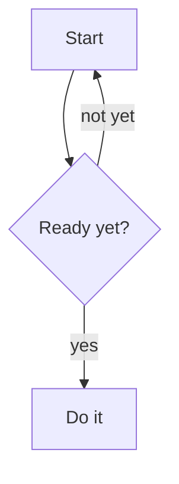

# Markdown All-Formats Test

This document contains every format Nyerat supports, plus the tricky cases. Open it in the editor and move the cursor to each line: the syntax must be hidden on other lines and appear on the active line.

## 1. Heading

# Heading 1
## Heading 2
### Heading 3
#### Heading 4
##### Heading 5
###### Heading 6

## Heading with closing marks ##

####### Seven hashes is not a heading

#No space is not a heading

## 2. Emphasis

Text **bold with asterisks** and __bold with underscores__.

Text *italic with asterisks* and _italic with underscores_.

Text ***bold italic*** and ___bold italic underscores___.

Text ~~struck through~~ and ==highlighted==.

Combined: **bold with *italic* inside it** and *italic with **bold** inside it*.

Emphasis in the middle of a word: un**believ**able and un*believ*able.

Single letter: **a**, *b*, ~~c~~, ==d==.

## 3. Inline code

The command `gjs -m nyerat.js` is run in the terminal.

Code with a backtick inside it: ``console.log(`hello`)``.

Formatting inside code is not processed: `**not bold**`, `*not italic*`, `[not](a link)`.

## 4. Links and images

A plain link: [GTK](https://www.gtk.org).

A link with a title: [GNOME](https://www.gnome.org "GNOME website").

A link with formatting: [**bold** and *italic*](https://example.com).

A relative link: [README](../../README.md).

Links between documents: [[README]], [[README#Features|features section]], and `[[not a link]]` inside code.

Autolink: <https://example.org> and <mailto:hello@example.com>.

A bare URL: https://developer.gnome.org/documentation/ in the middle of a sentence.

A URL with underscores does not become italic: https://example.com/this_file_name.html and [link](https://example.com/a_b_c).

An image from the internet: 

A local image with a relative path:


An image with a title: 

Two images on one line:  

An image that does not exist: 

## 5. Escape

\*not italic\*, \*\*not bold\*\*, \`not code\`, \[not a link\](url), \# not a heading.

Backslash: C:\\Users\\eka

## 6. Lists

A list with minus signs:

- One
- Two
- Three

A list with asterisks and plus signs:

* Star
+ Plus

A numbered list:

1. First
2. Second
3. Third

Numbered with parentheses, starting from 7:

7) Seven
8) Eight

A nested list:

1. Fruit
   - Apple
   - Orange
     - Pomelo
     - Lime
2. Vegetables
   1. Spinach
   2. Water spinach

A list with formatting: **bold**, *italic*, `code`, and [link](https://example.com):

- Item **bold**
- Item with `code`
- Item with a [link](https://example.com)

An item with several paragraphs:

- The first paragraph of this item.

  The second paragraph of the same item.

- The next item.

## 7. Task list

- [x] Finished task
- [ ] Unfinished task
- [X] Finished with a capital X
- [ ] Task with **bold** and `code`
  - [ ] Subtask
  - [x] Finished subtask

## 8. Quotes

> A one-line quote.

> A multi-line quote.
> Second line with **bold** and *italic*.
> Third line with `code`.

> A nested quote:
>> Level two.
>>> Level three.

> A quote containing a list:
> - One
> - Two

## 9. Code blocks

```js
// JavaScript
function hello(name) {
    return `Hello, ${name}!`;  // **not bold** inside code
}
```

```python
def hello(name):
    return f"Hello, {name}!"
```

```
A code block without a language.
    Indentation is preserved.
<b>HTML</b> & special characters must be escaped on export.
```

~~~bash
# Tilde fence
echo "hello"
~~~

````markdown
A four-backtick fence can contain three backticks:
```
code
```
````

## 10. Tables

| Left | Center | Right |
| :--- | :----: | ----: |
| a | b | c |
| **bold** | `code` | [link](https://example.com) |
| looooooooong | 🎉 | 123 |

A table without pipes at the edges:

Name | Value
--- | ---
One | 1
Two | 2

A table with formatting, an escaped pipe, a one-dash separator, plus CJK and emoji:

| Feature | Example |
| - | :-: |
| Pipe inside a cell | a \| b |
| CJK and emoji | 日本語 🎉 |
| ~~Strike~~ and ==highlight== | *italic* and `code` |

## 11. Horizontal rules

Three styles:

---

***

___

## 12. Line breaks

This line ends with two spaces  
so the next line moves down.

This line ends with a backslash\
so the next line moves down too.

This line has no marker
so it is joined with the next line.

## 13. Unicode and emoji

Emoji before formatting: 🎉 **bold** 🚀 *italic* ✨ `code` 👍🏽 [link](https://example.com).

Other languages: こんにちは **世界**, Ελληνικά *κείμενο*, العربية ~~نص~~, Ñandú ==ü==.

Symbols: → ← ↑ ↓ • © ® ™ ½ ≠ ≤ ≥ ∞

## 14. Mermaid and DBML diagrams



```dbml
Table users {
  id integer [pk, increment]
  email varchar(255) [unique, not null]
}

Table posts {
  id integer [pk]
  user_id integer [not null, ref: > users.id]
  title varchar(200)
}
```

## 15. Tricky cases

A variable name like snake_case_like_this does not become italic.

The formula 2 * 3 * 4 = 24 does not become italic.

A single asterisk * in the middle of a sentence.

Unclosed emphasis: **not closed, *neither is this.

Square brackets [not a link] and (not one either).

An empty heading below:

#

A very long line to test text wrapping: Lorem ipsum dolor sit amet, consectetur adipiscing elit, sed do eiusmod tempor incididunt ut labore et dolore magna aliqua. Ut enim ad minim veniam, quis nostrud **exercitation ullamco laboris** nisi ut aliquip ex ea commodo consequat. Duis aute irure dolor in *reprehenderit in voluptate* velit esse cillum dolore eu fugiat nulla pariatur.

The last line without a trailing newline at the end of the file.