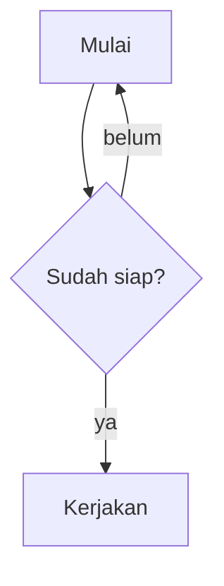

# Uji Semua Format Markdown

Dokumen ini berisi semua format yang didukung Nyerat, ditambah kasus-kasus sulit. Buka di editor lalu gerakkan kursor ke setiap baris: sintaksnya harus tersembunyi di baris lain dan muncul di baris aktif.

## 1. Heading

# Heading 1
## Heading 2
### Heading 3
#### Heading 4
##### Heading 5
###### Heading 6

## Heading dengan tanda penutup ##

####### Tujuh pagar bukan heading

#Tanpa spasi bukan heading

## 2. Penekanan

Teks **tebal dengan bintang** dan __tebal dengan garis bawah__.

Teks *miring dengan bintang* dan _miring dengan garis bawah_.

Teks ***tebal miring*** dan ___tebal miring garis bawah___.

Teks ~~dicoret~~ dan ==distabilo==.

Gabungan: **tebal dengan *miring* di dalamnya** dan *miring dengan **tebal** di dalamnya*.

Penekanan di tengah kata: ka**ta**kan dan ka*ta*kan.

Satu huruf: **a**, *b*, ~~c~~, ==d==.

## 3. Kode inline

Perintah `gjs -m nyerat.js` dijalankan di terminal.

Kode dengan backtick di dalamnya: ``console.log(`halo`)``.

Format di dalam kode tidak diproses: `**bukan tebal**`, `*bukan miring*`, `[bukan](tautan)`.

## 4. Tautan dan gambar

Tautan biasa: [GTK](https://www.gtk.org).

Tautan dengan judul: [GNOME](https://www.gnome.org "Situs GNOME").

Tautan dengan format: [**tebal** dan *miring*](https://example.com).

Tautan relatif: [README](../../README.md).

Autolink: <https://typora.io> dan <mailto:halo@example.com>.

URL polos: https://developer.gnome.org/documentation/ di tengah kalimat.

URL dengan garis bawah tidak jadi miring: https://example.com/nama_file_ini.html dan [tautan](https://example.com/a_b_c).

Gambar dari internet: 

Gambar lokal dengan path relatif:


Gambar dengan judul: 

Dua gambar dalam satu baris:  

Gambar yang tidak ada: 

## 5. Escape

\*bukan miring\*, \*\*bukan tebal\*\*, \`bukan kode\`, \[bukan tautan\](url), \# bukan heading.

Garis miring terbalik: C:\\Users\\eka

## 6. Daftar

Daftar dengan tanda minus:

- Satu
- Dua
- Tiga

Daftar dengan bintang dan plus:

* Bintang
+ Plus

Daftar bernomor:

1. Pertama
2. Kedua
3. Ketiga

Bernomor dengan kurung dan mulai dari 7:

7) Tujuh
8) Delapan

Daftar bersarang:

1. Buah
   - Apel
   - Jeruk
     - Jeruk bali
     - Jeruk nipis
2. Sayur
   1. Bayam
   2. Kangkung

Daftar dengan format: **tebal**, *miring*, `kode`, dan [tautan](https://example.com):

- Item **tebal**
- Item dengan `kode`
- Item dengan [tautan](https://example.com)

Item dengan beberapa paragraf:

- Paragraf pertama dari item ini.

  Paragraf kedua dari item yang sama.

- Item berikutnya.

## 7. Daftar tugas

- [x] Tugas selesai
- [ ] Tugas belum selesai
- [X] Selesai dengan X besar
- [ ] Tugas dengan **tebal** dan `kode`
  - [ ] Subtugas
  - [x] Subtugas selesai

## 8. Kutipan

> Kutipan satu baris.

> Kutipan beberapa baris.
> Baris kedua dengan **tebal** dan *miring*.
> Baris ketiga dengan `kode`.

> Kutipan bersarang:
>> Tingkat dua.
>>> Tingkat tiga.

> Kutipan berisi daftar:
> - Satu
> - Dua

## 9. Blok kode

```js
// JavaScript
function halo(nama) {
    return `Halo, ${nama}!`;  // **bukan tebal** di dalam kode
}
```

```python
def halo(nama):
    return f"Halo, {nama}!"
```

```
Blok kode tanpa bahasa.
    Indentasi dipertahankan.
<b>HTML</b> & karakter khusus harus di-escape saat ekspor.
```

~~~bash
# Pembatas tilde
echo "halo"
~~~

````markdown
Pembatas empat backtick bisa memuat tiga backtick:
```
kode
```
````

## 10. Tabel

| Kiri | Tengah | Kanan |
| :--- | :----: | ----: |
| a | b | c |
| **tebal** | `kode` | [tautan](https://example.com) |
| panjaaaaaaaang | 🎉 | 123 |

Tabel tanpa pipa di tepi:

Nama | Nilai
--- | ---
Satu | 1
Dua | 2

Tabel dengan format, pipa yang di-escape, pemisah satu strip, serta CJK dan emoji:

| Fitur | Contoh |
| - | :-: |
| Pipa di dalam sel | a \| b |
| CJK dan emoji | 日本語 🎉 |
| ~~Coret~~ dan ==stabilo== | *miring* dan `kode` |

## 11. Garis pemisah

Tiga gaya:

---

***

___

## 12. Baris baru

Baris ini diakhiri dua spasi  
jadi baris berikutnya turun.

Baris ini diakhiri backslash\
jadi baris berikutnya juga turun.

Baris ini tanpa penanda
jadi digabung dengan baris berikutnya.

## 13. Unicode dan emoji

Emoji sebelum format: 🎉 **tebal** 🚀 *miring* ✨ `kode` 👍🏽 [tautan](https://example.com).

Bahasa lain: こんにちは **世界**, Ελληνικά *κείμενο*, العربية ~~نص~~, Ñandú ==ü==.

Simbol: → ← ↑ ↓ • © ® ™ ½ ≠ ≤ ≥ ∞

## 14. Diagram Mermaid



## 15. Kasus sulit

Nama variabel snake_case_seperti_ini tidak jadi miring.

Rumus 2 * 3 * 4 = 24 tidak jadi miring.

Bintang tunggal * di tengah kalimat.

Penekanan tidak ditutup: **tidak ditutup, *juga tidak.

Tanda kurung siku [bukan tautan] dan (bukan juga).

Heading kosong di bawah ini:

#

Baris yang sangat panjang untuk menguji pembungkusan teks: Lorem ipsum dolor sit amet, consectetur adipiscing elit, sed do eiusmod tempor incididunt ut labore et dolore magna aliqua. Ut enim ad minim veniam, quis nostrud **exercitation ullamco laboris** nisi ut aliquip ex ea commodo consequat. Duis aute irure dolor in *reprehenderit in voluptate* velit esse cillum dolore eu fugiat nulla pariatur.

Baris terakhir tanpa baris baru di akhir file.